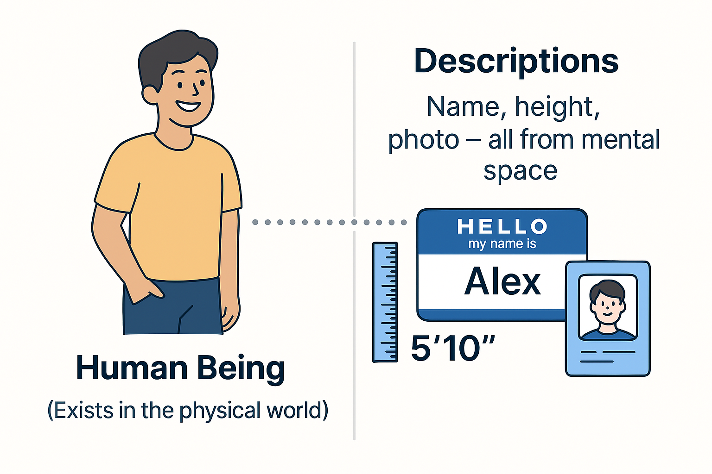

To understand the concepts explored in this section, let's begin by distinguishing between **concepts** and **words** that describe the physical world and the mental space.

Continuous progress in the number of interacting people and the speed at which humans adapt to new conditions has become possible because people have learned to communicate through signs, words, drawings, and so on. They invented letters, the alphabet, numbers, and much more to describe the physical world.

There is the word "лев" (in Russian) or "lion," and then there is the living creature that roams the African savannas. The living creature is part of the physical world, while the words "лев" and "lion" are descriptions of this creature. All descriptions originate from the mental space. I am a human being, and my description includes my name, height, etc. My photograph also belongs to the description.

Thus, humans have created another "world"—the **world of descriptions** or the **mental space**. This is essential for humans to change the physical world, to make it better^[A performer improves the world by creating successful systems.]. Therefore, a systems professional in any project uses an important thinking technique—asking themselves: "What changes in the physical world as a result of my actions?" If an action, project, or activity does not lead to a change in the physical world at some point, then such an activity is meaningless^[Changes in the world can be considered as the impressions you gain from implementing an entertainment project.]. Resources will be spent, but the world will not be improved^[For example, you could do extensive paperwork that is of no use to anyone. Or dig a hole and then fill it back in.].

**Humans have also devised** **theories to describe or model reality** (create descriptions)^[And, of course, through which they create systems. But here, we want to focus specifically on descriptions.]. Worldviews or models^[Note that the word "model" in this context relates more to content, although it may refer to a specific object. For instance, I have assembled a model airplane.] are descriptions of parts of the physical world that can be derived using certain theories (a historical example being the invention of photography). However, there is no single description of the entire physical world. For instance, a geographical map is a model or description of a specific territory, not the entire universe. We understand that the territory exists in the real, physical world. And this territory can have many different descriptions (economic or political aspects, natural resources, etc.)^[As you might have guessed, each description addresses a particular subject of interest concerning the territory.].

Descriptions of the real world can be divided into two categories: **scientific and non-scientific**. Scientific descriptions are theories, disciplines, trans-disciplines. Non-scientific ones include stories, legends, superstitions, myths. The difference between them is that scientific theories provide explanations of some part of reality that withstand scrutiny by the scientific method. This is independent of the person conducting the review. Furthermore, theories can be recorded in consistent symbols as formulas or concepts, conveying the same substantive meaning in different languages. In contrast, non-scientific theories do not possess this formal rigor, although they also describe the physical world. However, we will only discuss scientific worldviews moving forward.