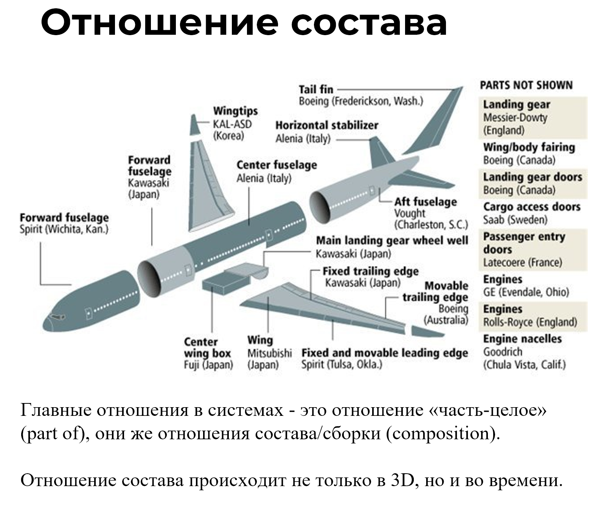

When discussing implementation, it's important to consider the key relationships within systems, specifically the **part-whole relationship, also referred to as composition or assembly relations.** 

Engineers commonly refer to this as the breakdown of a system. The core of systems is **systematic breakdowns**. The resulting tiers of this breakdown are known as **system levels**. A systems practitioner's thinking mastery is well-developed, enabling them to dissect any domain into system levels from various contexts (subjects of interest).

**Breakdowns are performed by a person's attention in a role** or by a team; nothing is physically divided in the real world! If we focus our attention on an elephant and differentiate it into trunk, ears, legs, tail, etc., it doesn’t mean we've physically detached these parts. We've singled them out for a specific purpose^[For certain goals, like understanding or analysis.]. Similarly, we've identified the entire elephant as part of the physical world using our attention because we need the elephant in this context. We can extend this process to include a herd of elephants and further to the savannah, where other animals coexist. In this way, we've designated several system levels through our attention.

The fundamental approach in these divisions is **from part to whole** or **from whole to part** **considering 4D-dimensions**. In 3D, it's fairly straightforward: a wing and fuselage are parts of an airplane, the fuel pump is part of the engine, which in turn is a component of the airplane. Accepting that systems reside not just in physical space, but within spacetime, means the discussion about different system states or roles translates to discussing parts over time. For instance, the egg is just a time-bound part of a butterfly — while the butterfly is in the "egg" stage, no other butterfly takes the egg's place in the physical world.

Thus, system states or roles can be treated as separate objects and can have **individual names**. A butterfly in the "egg" stage is called an "egg." John Smith, when ill, is referred to as a "patient." Here, "patient" is merely a role or state of John Smith.

**Dividing a system into parts, especially when time is involved, is a complex skill**. It requires practice. One should start with understanding composition relations. Unfortunately, intuition often falls short here. Systems thinking is counterintuitive, sometimes necessitating an instructor's guidance. Additionally, practicing with educational tasks is crucial. We'll delineate system levels in Section 5, but in this section, attempt to identify subsystems, sub-subsystems, and supersystems within a given system.