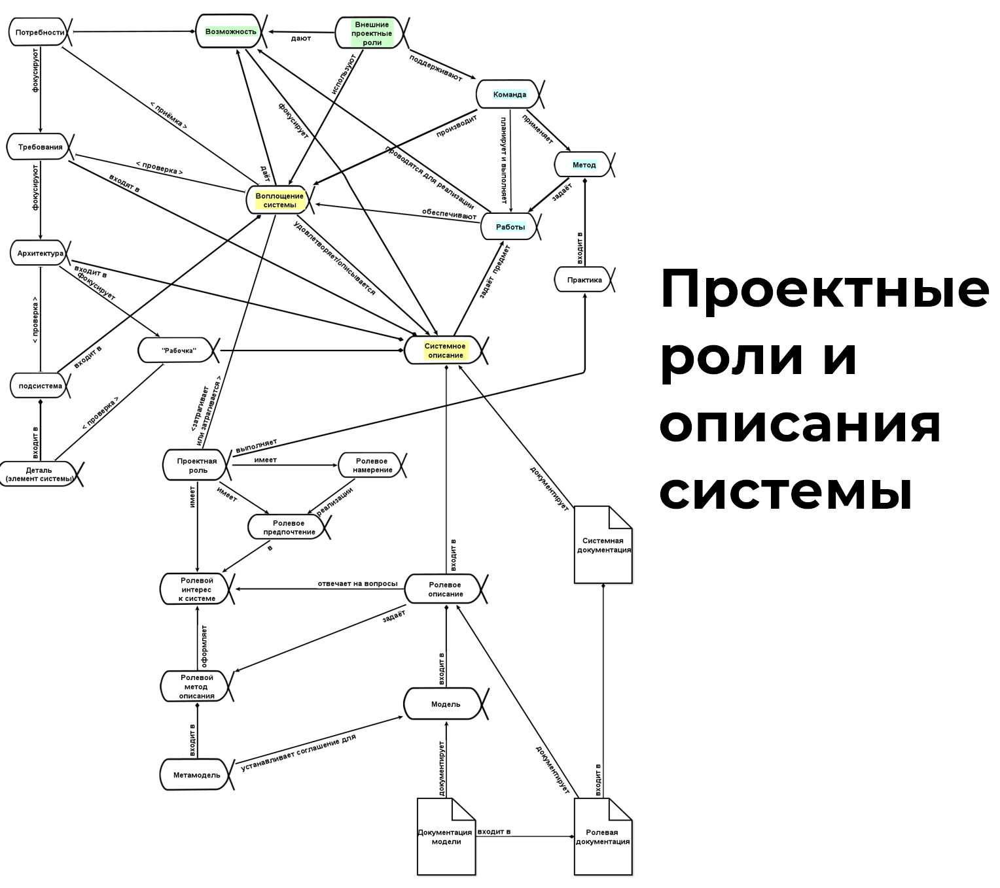

The diagram in the "Systems Thinking" textbook illustrates most of the terms related to systems thinking that we have already discussed. Fluency in systems thinking, which allows you to apply it to work projects, means that you can **easily see the interconnections of these concepts**. On this diagram, there are 7 main concepts (alpha^[The OMG Essence standard (http://www.omg.org/spec/Essence/) provides a special type of functional objects for monitoring project progress — alpha (ALPHA or Abstract-Level Progress Health Attribute). Alpha is an object of focus, whose functional/role nature corresponds to the area of interest "how the project works" (not the target system, but the project, i.e., the systems of creation). If we want to think coherently about how the project functions, how the target system is created and then developed by its creators during their work, we must focus on alphas, not on arbitrary objects in the project.]) highlighted in color, while other concepts and sub-alphas are not highlighted. However, it is evident that all concepts are interconnected. Most of these connections lead to the implementation of the system. This is our successful system, for which we are studying systems thinking with all these systems concepts.

You might think this approach is somewhat redundant. But imagine drawing an everyday conceptual network centered around an automobile. Adults have fluency in thinking about the concept of "automobile," not from a systems approach, but simply as an area of understanding. You'll likely quickly identify concepts such as fuel, movement, weather, passenger, environment, luxury, winter tires, and many others that help explain activities related to automobiles.

You can easily draw a diagram linking all these concepts together^[Fuel is poured into the car's fuel tank. In this simple sentence, I've described the physical world. For this, I used the concepts "fuel" and "fuel tank," and linked them with another action concept "pour." The point is that you are well-acquainted with these concepts, and your mind easily connects them and quickly models the physical world. If the fuel begins to spill outside of the fuel tank, you would take certain actions. These actions can also be described with a certain model.]. For a 17th-century resident, many terms related to automobiles would be completely unclear. But you effortlessly operate with these concepts because you live among them. Similarly, it is advised to **'immerse yourself' in the concepts of systems thinking** to create successful systems in your personal life and work projects. Fluent use of systems concepts means you swiftly identify them in your project, such as the target system or a description method for a subject of interest like "price" or "safety"^[Similarly, in everyday life, you fluently use the concepts "mother" and "father," and, for example, when you visit a friend's house, you quickly discern who is who.].

The use of systems concepts is necessary to **compose** **(model)** **system descriptions** required for creating successful systems. This involves creating descriptions across all areas of interest for the supersystem, target system, and creator.

In this section, we will focus on the following:

* how to **describe any systems** **using systems language**, including role descriptions, models, description methods, etc.;
* learning about four main descriptions of a system as a transparent box, which address **subjects of interest in the internal structure of any system**;
* the types of documentation available for **areas of interest of the three kinds of systems**.