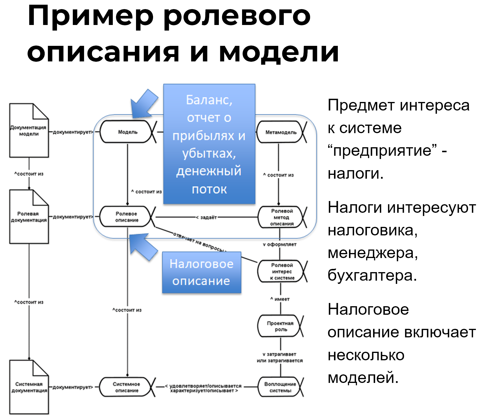

**Translation:**

In the first section of the course, we discussed that a system possesses certain classic properties and relies on project roles. We then found out that there are numerous subjects of interest to the system, and each **description is created for a specific subject of interest**.

In the adapted diagram from **ISO 42010 standard**^[For more details about this standard, read the textbook "Systems Thinking".], you can see how to consider the interests in the system, project roles, role descriptions, models, and more. This international standard offers guidance on how to think about systems description.

The standard itself only addresses architectural descriptions, but its principles can be applied to various descriptions of different systems. For example, you can use this framework not for the target system, but for the system of creation.

In practice, everything usually starts with identifying the type of role description that arises from a certain interest. For instance, when it comes to a business, there is a **subject of interest—taxes**. There are specific project roles (with their methods and work products) that have this subject of interest. However, preferences in this subject of interest may differ for a tax officer, a manager, and an accountant.

To address this subject of interest, a tax description is formed, which should include all the preferences of the project roles. Each project role has its own needs, but to reach agreement, it's necessary to create a common description for all interested project roles^[That is, those having the same subject of interest.].

This description consists of certain models. Discussing the tax issue is straightforward because many **meta-models** are established by the state in respective regulatory documents. These include documents like the "Balance Sheet," "Profit and Loss Statement," and others. Once these meta-models are filled with appropriate reporting data, they become models—descriptions of a specific business and its economic activities.

As you have probably guessed, there is a particular **method of description** used to create this tax description. It is the method of accounting and tax reporting.

The state focuses on taxes, promoting its subject of interest through the regulatory approval of description methods (meta-models) and meticulously reviews the models presented by accountants. Follow the example of tax officers in how to pay attention to modeling.

However, on the other hand, remember that ultimately you need the **implementation of the system**, and the description provided in the form of models, drawings, manufacturing instructions, etc., is necessary only because, without it, it is very challenging to bring a functioning system to life.