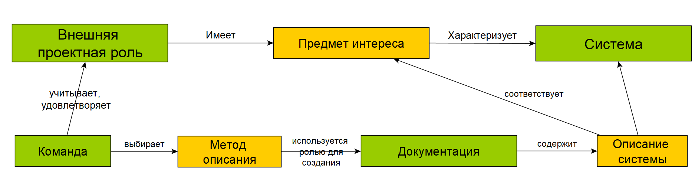

In previous sections, it was discussed that the **subject of interest** is connected to the system. A system can be characterized by different subjects of interest. These subjects are linked to **project roles**, meaning that individuals in these roles are interested in certain characteristics of the system.

The **team** determines which interests of the project roles^[From all considered project roles, subjects of interest and/or preferences are selected to be addressed. It's impossible to satisfy all interests due to potential resource constraints (funds and time), but on the other hand, the team must avoid making an obvious mistake. An obvious mistake can occur if the team overlooks an interest, leading to significant and irreparable costs later on.] will be addressed during the creation of the system. Consequently, this affects what **work products** (**documentation**) will be needed. Work products are the physical media containing system descriptions that address specific subjects of interest.

To create documentation, one must possess certain practices^[As you remember, a project role creates a work product based on practice.] or methods of description. Through this **method** of **description**, a system description that answers the subject of interest is created on a physical medium.

For instance, a racer's interest is in the speed of the racing car. Alternatively, it can be said that the external project role "racer" has the subject of interest "speed" towards the system "racing car." The developers decided to satisfy the racer's interests, implying that the team considered this project role's interests should be met. This means that further work will continue with this subject of interest, during which documentation (a computer model) will be created.

Next, developers choose a description method to craft the system's description. They select one of the description methods that enables them to construct a computer model for calculating the car's speed^[Both the theoretical aspect of the calculations and the computational aspect of conducting these calculations are important here.]. This computer model is a work product containing the system description of the car related to the subject of interest, speed.

Incidentally, this model might consider not only the specified subject of interest but also others. The overall number of work products (documentation) related to system descriptions is proportional to the number of subjects of interest, and the **number of subjects of interest is proportional to the number of project roles** that the team has decided to satisfy^[As you recall, all project roles are considered, but the team may decide to satisfy only selected ones. For each of them, a work product is created to meet the project role's needs. The diagram illustrates only the external project role, but the same applies to internal project roles.].