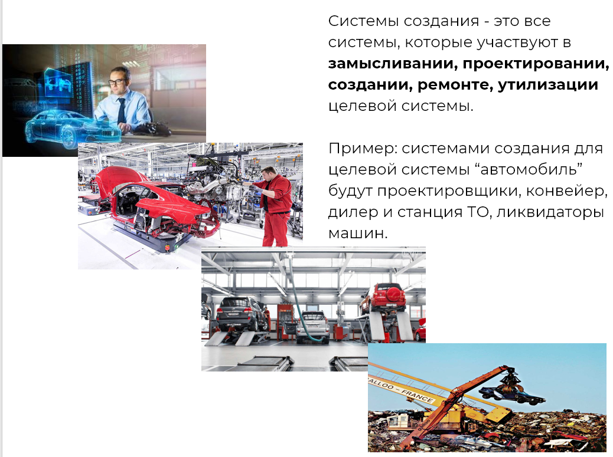

Every activity becomes much more productive when you understand its purpose. From a systems approach perspective, it can be said that **the goal of any activity is to create a target system.** Accordingly, the systems of creation are involved in the endeavor to bring this target system into the physical world. This creative activity is typically referred to as a project, process, program, and so on. It's important not to confuse types like "project" with "enterprise" (or "extended enterprise") because the former refers to an activity, while the latter is a system.

For instance, the purpose of the creation systems' activity would be the target system—the Mercedes E-Class automobile. Meanwhile, the factory activity is the process in which certain creation systems participate, such as those involved in assembly.

**We refer to creation systems as** **those systems that support all stages of the system's development from its initial conception to disposal.** In our example with the target system "automobile," factory activity involves designers, component suppliers, and assembly lines. However, creation systems also include service stations and car dismantlers, which may not necessarily be part of the automotive corporation. It's very rare for all creation systems to be part of a single enterprise, which is why we refer to an **extended enterprise.**

An important note about the systems of creation is that no activity should be referred to as a target system. Firstly, activity is not a system (neither target nor creator nor any other kind). Secondly, when you observe an activity, it is likely the activity of some creation systems working to create a specific system (either target or ours). Therefore, it is essential to first understand the purpose of this activity. It is quite likely aimed at creating a system. That system will probably be the target system, whereas what you're engaged in—factory activity, for instance—will merely be the activity of some creation systems.

Additionally, it's not recommended to call a factory a target system. More likely, the factory's production will be the target system. Therefore, it's important to always determine what the factory produces. An iron factory and an automobile factory are entirely different enterprises. The target system defines what the systems of creation must be like. So, first, we must understand what the enterprise produces to better conceive how it should be structured. Essentially, the type of factory needed depends on the factory's production, which will be the target system.

Only then can you move on to another project where the creation system becomes "our system." Often in project activities, you might think about the target system "automobile," but at the same time, you'll need to build a factory (hire and organize people) that will produce the automobile. In such cases, it is necessary to manage focus, separating these two considerations.