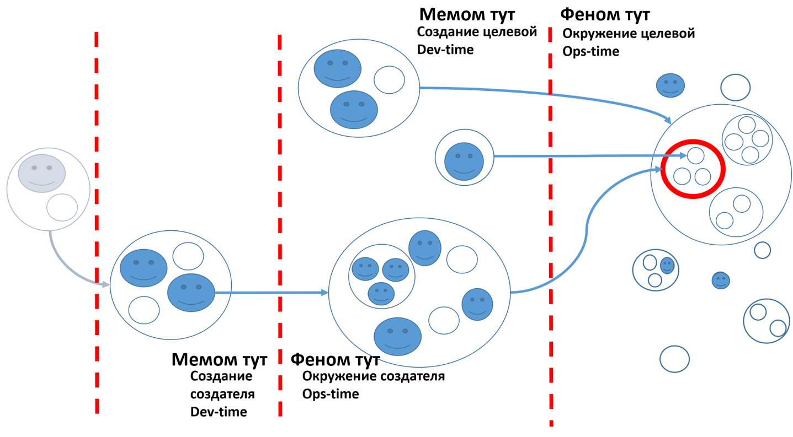

By understanding all types of systems, you'll be able to unravel any complex activity faster than others. You can literally dissect the world with your attention, highlighting specific systems. The world is complex, and all its elements are interconnected. The human brain struggles to grasp all connections, so **principles are established in systems thinking for logically dividing the world into parts.** It's much easier to understand individual parts, without losing their connection to the whole.

For instance, in the diagram on the left from the course "Systems Thinking"^[You'll get to familiarize yourself with this diagram while describing your activities, identifying corresponding systems.], you can see the systems levels in relation to the target system, represented by the red circle. At the top is the supersystem (the large circle containing the red one), within which is the target system (the red circle), and at this same system level are two surrounding systems. At the system level within the target system, we notice three subsystems. This scheme aligns well with our example of an automobile. Try associating the automobile with its subsystems, driver, and passenger.

Beyond the dashed line are numerous creation systems. Some form the supersystem, others are systems for creating the target system, and still others participate in creating subsystems. This scheme allows discussion not only about an automobile, factory, but also the system that constructs the factory. Of course, such complex schemes aren't always necessary, but it's important to realize that systems thinking helps in examining the most intricate systems and activities. Try using this scheme to analyze your company's operations. I should warn you, it will be quite challenging. We delve into student case studies more comprehensively during training sessions with the instructor.