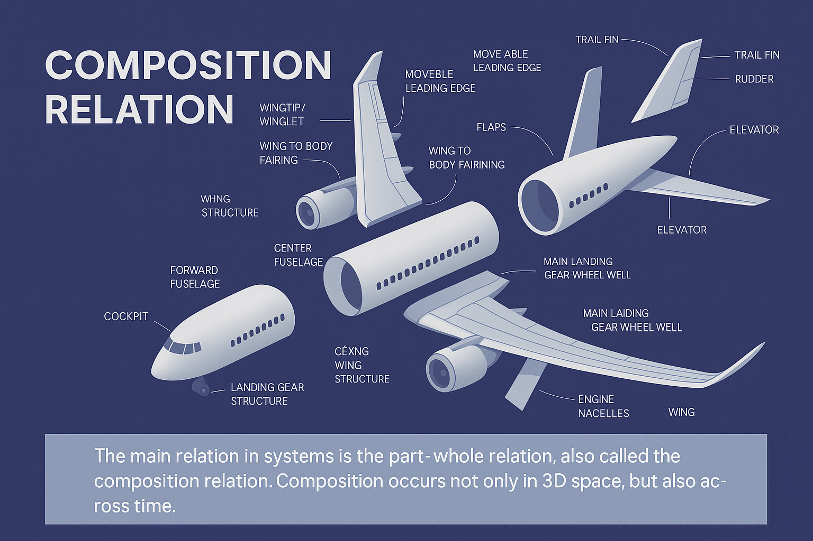

# Composition Relationship

When discussing implementation, it's important to consider the primary relationships in systems, known as the relationship of "part-whole," also referred to as composition or assembly relationships.

Engineers often describe this as the breakdown of a system. The crucial aspect of systems is system breakdowns. The levels of this breakdown are the system levels. A system constructor is well-versed in the cognitive technique that allows them to break down any subject area into system levels based on different contexts (subjects of interest).

Breakdowns are achieved through the attention of a person in a role or a team; nothing gets physically broken down in the real world! If we use our attention to break an elephant into a trunk, ears, legs, tail, etc., it doesn't mean we've physically separated these parts from the body. For some reason...[^1], we have distinguished these parts of the elephant using our attention! Moreover, we have distinguished the entire elephant as a part of the physical world with our attention! After all, it was an elephant that we needed. We can go further and distinguish a group of elephants, and then the savannah, where other animals besides elephants reside. In this way, we have singled out several system levels with our attention.

The main approach in breakdowns is from part to whole or from whole to part in relation to the 4D dimension. In the 3D space, things are more or less clear: a wing and a fuselage are parts of an airplane, the fuel pump is part of the engine, which, in turn, is part of the airplane. If we accept that all systems exist not just in physical space but in space-time, then the entire discussion about different states of a system or its different roles becomes a discussion about parts over time. For example, an egg is merely a part of a butterfly in time — while a butterfly is at the "egg" stage, there is no other "butterfly" that takes the egg's place in the physical world.

Therefore, the states of a system or its roles can be treated as separate objects, and they can even have separate names. A butterfly in the "egg" stage is called an "egg." John Smith, while ill, is called a "patient." Here, "patient" is just a role or a state of John Smith.

Dividing a system into parts, especially when it comes to time, is a complex skill. It requires practice. You will have to start with understanding the composition relationship. Unfortunately, intuition often fails here. Systems thinking is counterintuitive, which is why assistance from an instructor is sometimes necessary. Furthermore, it's crucial to practice solving educational problems. We will identify system levels while studying section 5, and in this section, try to identify a subsystem, a sub-subsystem, and a supersystem within the system.

[^1]: For some purposes, like eating the elephant piece by piece.