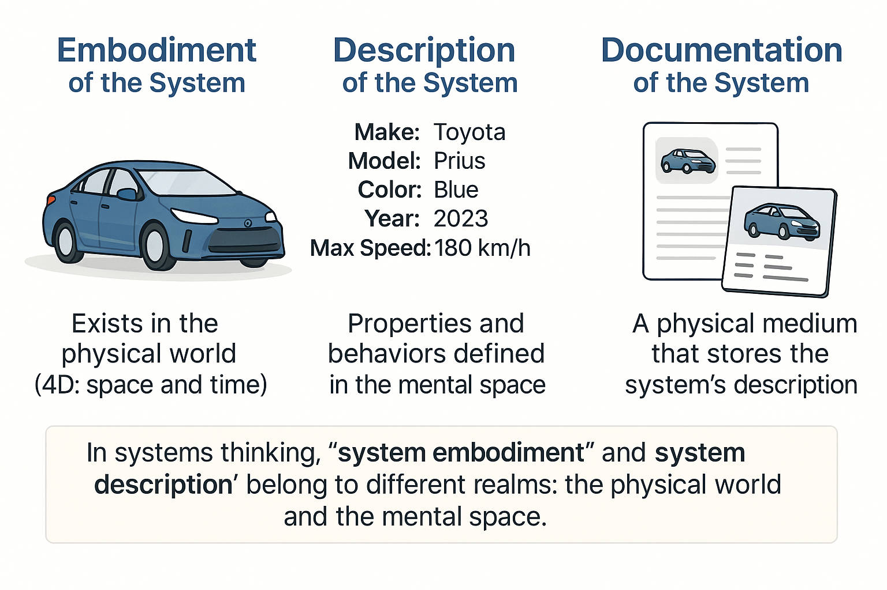

# Description and Implementation of the System

At **Aisystant**, the course "Rational Work" teaches participants to distinguish between the physical world and the mental space, whether in speech or writing. This course also trains individuals to connect abstract reasoning to the physical world. People cannot function without mental concepts, as they facilitate communication. However, one must not lose sight of physical world objects when dealing with words and symbols. Particularly in project activities, "losing touch with reality" should be avoided; otherwise, creating successful systems becomes challenging.

For example, an insolvency manager in a company's bankruptcy might mistakenly believe that their role's purpose is to enter data into the liquidation register. However, this entry is merely information confirming that all remaining company assets have been allocated to creditors. These assets exist in the physical world and represent the manager's true objective and system. The register entry merely describes this system. Thus, in any activity, one must not confuse the system itself and its description. This thinking approach (and skill) requires practice. Initially, it's crucial to thoroughly understand the concepts of "system embodiment" and "system description."

In systems thinking, the concepts of "system embodiment" and "system description" pertain to different realms. "Embodiment" refers to material objects in the physical world, while "description" emphasizes that the discussion involves the mental space, not the physical essence of the system.

Interestingly, the term "system embodiment" might seem tautological because when we say "system," we already imply a physical object that is realized in reality. However, the word "embodiment" is deliberately used with "system" to contrast it with "system description." Often, discussions about "system embodiment" occur alongside conversations about "system description."

A system's embodiment can be a distinct system as a physical object. For instance, this "Blue Lagoon" cocktail in hand or this specific pencil. These objects are literally present in the physical world and exist in four dimensions (4D): length-width-height and time.

When we describe a system, we use words or terms that define its characteristics, properties, actions, attributes, behavior, states, and so forth. Consider terms such as color, price, height, weight, desires, and so on. These words differ from terms like "car," "table," or "clock," which denote physical objects.

Describing a system requires specific methods^[More on this concept in section 6.]. Each characteristic draws on its own worldviews, theories, and disciplines. For instance, to describe a car's price, you must understand pricing methods, whereas discussing a company for a shareholder necessitates comprehension of financial reporting like IFRS or US GAAP and specific technologies for preparing financial documents, such as SAP.

System descriptions are inherently abstract. This concept is needed to focus on the substantive aspect of the discussed system. Still, descriptions can be linked to the physical world by emphasizing form. To achieve this, one should consider the information carrier holding the system's description, leading to discussions about the system documentation.

Using the term "system documentation" implies focusing primarily on the physical medium containing the system description. For example, a menu is the documentation of the "cocktail" system. It contains a description of the cocktail: its ingredients, price, photo, etc.

Documentation is often created using tools (technologies) that implement specific disciplines used for system descriptions. For instance, "US GAAP Financial Reporting" documentation is generated using the IT system SAP.

Therefore, understanding the difference between system embodiment, description, and documentation concepts, and identifying them in your life, is a crucial thinking skill. Without proficiently distinguishing these concepts, progressing further in studying systems thinking will be impossible.