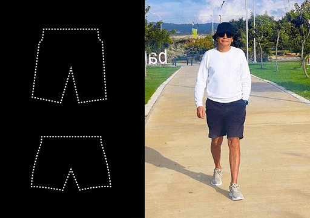

# Example: How to Prepare for a Trip Using Systems Approach

# Preparing for a Trip: A Systems Approach

I'm getting ready for another trip. I've decided to travel light, so I'm taking a small carry-on suitcase. There's no room for extra items, so I need to pack only the essentials. During this packing process, I've thought of a methodical example to help explain some concepts of systems thinking.

What should we consider? We will discuss different types of objects—functional and physical.

### Functional versus Physical Objects

An item or thing can be viewed from a functional perspective, focusing on its function, or from a physical perspective, where its physical characteristics are important and require us to see it in reality.

On this trip, I will need shorts and swim trunks. Usually, we don't consciously consider what kind of objects we are dealing with. But even if we don't distinguish between "functional objects" and "physical objects," it doesn't prevent us from making the right decision in this everyday example. However, when creating complex systems, distinguishing between these two concepts becomes extremely useful. This is the essence of systems thinking.

### Packing Process

Let's begin packing. At the packing stage, "shorts" and "swim trunks" are functional objects, not specific physical items. They have different functions, which is the most important thing to understand during the design process.

Right now, I am planning the trip and considering the necessary systems to be used. Therefore, I am thinking about systems as functional objects: what I will need (functional objects) to be well-equipped and fulfill different roles.

When I model the future, I prioritize thinking about functional objects.

### Constraints

Due to the size of the suitcase, I decide that I can only take one specific physical item, which will serve as either shorts or swim trunks depending on the situation.

Not just any item can fulfill both roles simultaneously (a role is synonymous with a functional object). Fortunately, I have such an item: long blue swim shorts from Boss. They will perform the functions of both shorts and swim trunks. These are what I'm taking on the trip. In various situations, I will use the specific physical object—long swim shorts.

### Understanding Concepts

The objects and things that surround us are labeled with the words commonly used in society. In culture, it's often customary to name objects based on their primary functional use.

We can say that things labeled "shorts" and "swim trunks" have inherited names from the functions of corresponding functional objects. For instance, shorts evolved from shortened trousers, and an airplane is an object where the primary function is to enable flight.

### Practicing Systems Thinking

A valuable system-thinking skill is distinguishing between the context of using the words "shorts" and "swim trunks." In every statement, you can track whether it's about functional objects or specific physical items (objects, things).

For example, consider these two statements: "I think I'll need shorts for the trip" and "I'm taking these blue shorts with me." In both sentences, the word "shorts" is used, but in the first sentence, it refers to a functional example, while in the second, it refers to a physical one.

This skill, among many other systems thinking skills, will be especially useful when dealing with systems in your work projects.