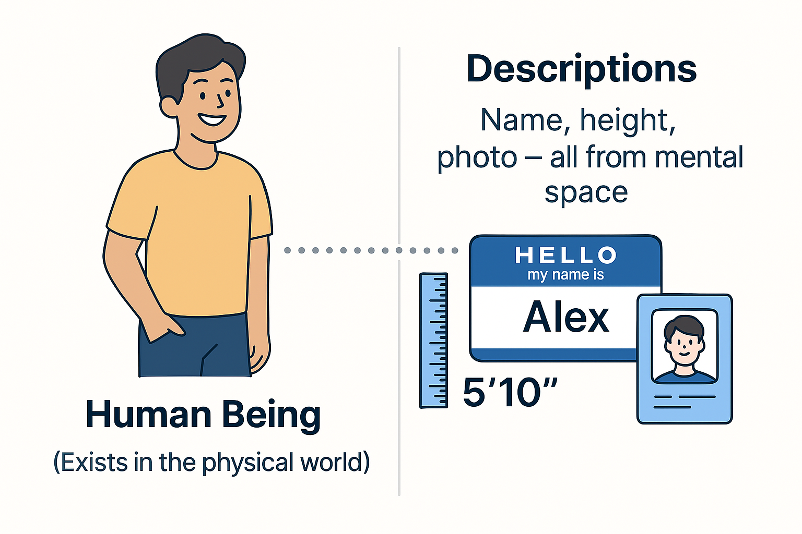

To understand the concepts studied in this section, let's start by differentiating between the concepts and words that denote the physical world and the mental space.

The continuous progress in the number of interacting people and the speed of human adaptation to new conditions has been made possible because people have learned to communicate using signs, words, drawings, etc. They invented letters, the alphabet, numbers, and much more to describe the physical world.

There is the word "лев" (in Russian) or "lion," and then there is the living creature that roams the African savannahs. The living creature is a representative of the physical world, while the words "лев" and "lion" are descriptions of this creature. All descriptions come from the mental space. I am a person, and my description includes my name, height, etc. My photograph is also part of a description.

Thus, humans have created another "world"—the world of descriptions or the mental space. This is essential for humans to change the physical world and make it better^[Constructors improve the world by creating successful systems.]. Therefore, a system constructor in any project uses an important mental technique—asking: "What changes in the physical world as a result of my actions?" If an action, project, or activity does not lead to a change in the physical world at some point, then such an activity is pointless^[Changes to the world might include the impressions you gain from an entertainment project.]. Resources will be spent, but the world will not improve^[Conditionally, you might undertake extensive paperwork that's unnecessary or dig a hole only to fill it back up again.].

Humans have also devised theories to describe or model reality (create descriptions)^[And, of course, with which they create systems. But here we want to focus on descriptions.]. Worldviews or models of the world^[Note that the word "model" in this context refers more to content, although it can mean a specific object. For instance, I've assembled a model airplane.] are descriptions of parts of the physical world that can be obtained using certain theories (the ability to take photographs was discovered at some point). There is no single description of the entire physical world. For instance, a geographical map is a model or description of a specific territory, not the entire universe. We understand that the territory exists in the real, physical world and can have various descriptions (economic or political aspects, natural resources, etc.)^[As you might guess, each description addresses a particular subject of interest regarding the territory.].

Descriptions of the real world can be classified into two categories: scientific and non-scientific. Scientific descriptions include theories, disciplines, and transdisciplines. Non-scientific descriptions include stories, legends, superstitions, myths. The difference between them lies in the fact that scientific theories provide explanations of certain parts of reality that withstand scrutiny by the scientific method and are not dependent on the examiner. Moreover, a theory can be recorded using the same symbols in the form of formulas or concepts, conveying the same substantive meaning in different languages. Conversely, non-scientific theories lack such formal rigor, though they also describe the physical world. Nevertheless, we will focus only on scientific worldviews going forward.