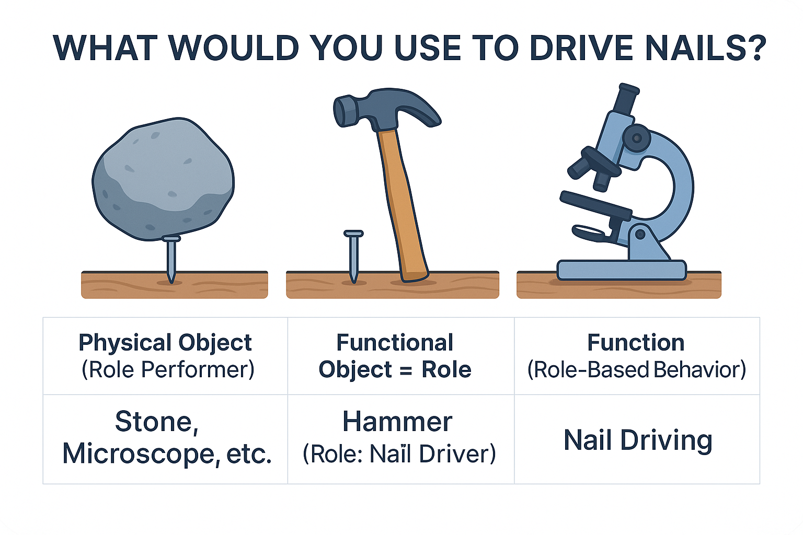

# Role Executor, Role, Function, and System Names

In the previous section, we briefly discussed the distinction between a physical object, a functional object, and functional (or role-based) behavior. For example, a physical object is a microscope^[When we say "microscope," we primarily mean the role of "microscope." However, it is also the name given to the physical item commonly referred to as a microscope. The context of the discussion clarifies this difference. It's beneficial if you've understood this duality, as in the case of a hammer. A systems-oriented person comprehends this distinction well. It's best to start with a stone.] or a stone. These objects can perform different roles and execute different functions assigned to them. In our example, the functional object or role is a "nail driver." Culturally, this role is known as a "hammer." Meanwhile, the function or functional or role-based behavior is to drive nails.

As we mentioned earlier, each role is associated with culturally-determined^[Or determined by cultural norms and rules, meaning what is accepted within a culture, behavior norms, usage, etc.] behavior and a corresponding name embedded in the culture. Everyone understands the role of a "hammer" and its nail-driving behavior. The physical item that can become a hammer^[That is, perform the role of a hammer. Note that the same reasoning applies if we were discussing how the role of a manager can be filled by John Doe or Jane Doe.] can vary.

This thought process, where things are named based on their primary function^[Or based on their role-based behavior.], significantly conserves the brain's cognitive power. First, we consider actions (behavior and other activities), and then we find physical objects that can perform these actions. Cultural conditioning allows for quicker agreements^[Not all established names for items adhere to this principle. Sometimes ancient names have unclear origins and often refer to form or something else rather than the role/function. As a rule of good practice, when developing a system, the team should look for the role—not the physical object representing the system—in the naming, and indicate the function or actions of this role.]: there is no need to repeatedly name a functional object a "person who drives a car." Instead, we quickly and succinctly denote this role as a driver^[Similarly, it was suggested earlier not to call a functional object "nail driver," but to use the role name "hammer" instead.].

Here is a brief excerpt from the textbook "Systems Thinking":

"Systems are first and foremost considered functional (role-based) objects when they perform their function, meaning they are ready and operational. At this point, they provide value to those who need this function. For instance, an airplane as a system is primarily a role-based or functional object capable of flight while carrying passengers and cargo through the air. The most common purpose or function of an airplane is to enable flight. This functionality is directly reflected in the system's name, 'airplane,' which combines 'air'—the medium in which it operates—and 'plane,' referring to the flat surfaces (wings) that generate lift for flight.

The primary purpose of a pump is to draw in. This is why culturally, the product is named accordingly. Manufacturers aim to please customers, so they name their products to quickly convey their usefulness. Customers consciously (or intuitively) grasp the desired function and familiarize themselves with the products starting from their functional names^[Products may have alternative names; for example, airplanes are named after great individuals.]. However, a system called "Pump NV-23"^[This refers to the physical object – "Pump NV-23," which can perform the function of drawing in and play the role of a pump.] may serve a different function for the customer. For instance, it could circulate antifreeze. In this scenario, the customer's request for a function has changed, requiring a functional object to act as an antifreeze circulator. Would "Pump NV-23" suit the role of "antifreeze circulator"? Possibly, it might.

Thus, a pump may be called an "antifreeze circulator in the second cooling circuit" if its role is to circulate antifreeze in the second circuit. The factory sells the physical object "Pump NV-23"^[This product was intended to fulfill the role of a pump, i.e., to perform the function of drawing in.], but the buyer might use it for a different role (circulator). This happens routinely. Without a usage context, it's "just a pump," meaning a structural object without an environment. In the context of role-playing, it's a role-based object, the "antifreeze circulator in the second cooling circuit." Outside the context of her engineering abilities, Masha is simply Masha, capable of many things. Like a microscope, which can display small objects or be used to crack nuts, drive nails, or act as a paperweight. And Masha can do many things. But when performing the function of an engineer, a role-based behavior, Masha will be called an "engineer." That's normal."

Hence, it is important to name systems based on their primary role^[Bear in mind that this rule might not apply to established item names, but in your projects, you'll save much time by adhering to it. You'll reach agreements faster and understand client requests and your product more clearly. More about naming systems can be found in Section 5 of the online course "Systems Thinking."], which defines their function. However, sometimes the function is clear, yet naming the role is complex^[Quickly, it becomes clear that a "nail driving" function is needed, thus the role is a nail driver. However, naming the role as a "hammer" requires a broad understanding of activity. While the concept of a hammer is fairly understandable to most, try naming project roles at an aircraft factory or naming the subsystems of an airplane.]. Good perceptivity of activities is required to easily find role names.

When we name a system "microscope," we primarily mean its ability to "examine small objects" at the moment it is fully constructed and operational. If we intended to hammer something with this object, we would say that the physical object "Microscope MP-2" would play the role of a "hammer" and perform the function of driving or pounding.

And should someone suddenly declare a person as a system, it's usually not immediately clear what their function is in their environment. A person is a multifunctional object capable of performing many actions, and a person can be viewed as a biological body (as medicine does, for example). We discussed in the previous section that a person can play diverse roles. Therefore, role behavior or functions of people must always be examined separately and with specificity. However, thinking about people in a role and about a microscope-in-a-role is structured the same way!^[Systems thinking begins by considering systems as role-based (functional) objects that behave in certain ways within their environment. That is, we first look at the performed or required function, played role, or designated purpose. Only then do we analyze the structure or the physical object that will perform the identified role.]

If you're struggling to grasp all these concepts and don't see the significance of this distinction for project activities, then you likely have gaps in your ontological knowledge. To master systems thinking, you need to have a type classifier^[Let us remind you, this is the ability to track the types of concepts being used and not confuse, for example, a role and its executor, a system and a process, a function and a structure, etc.]. If you encounter difficulties with this, we recommend taking the "Rational Work" course.