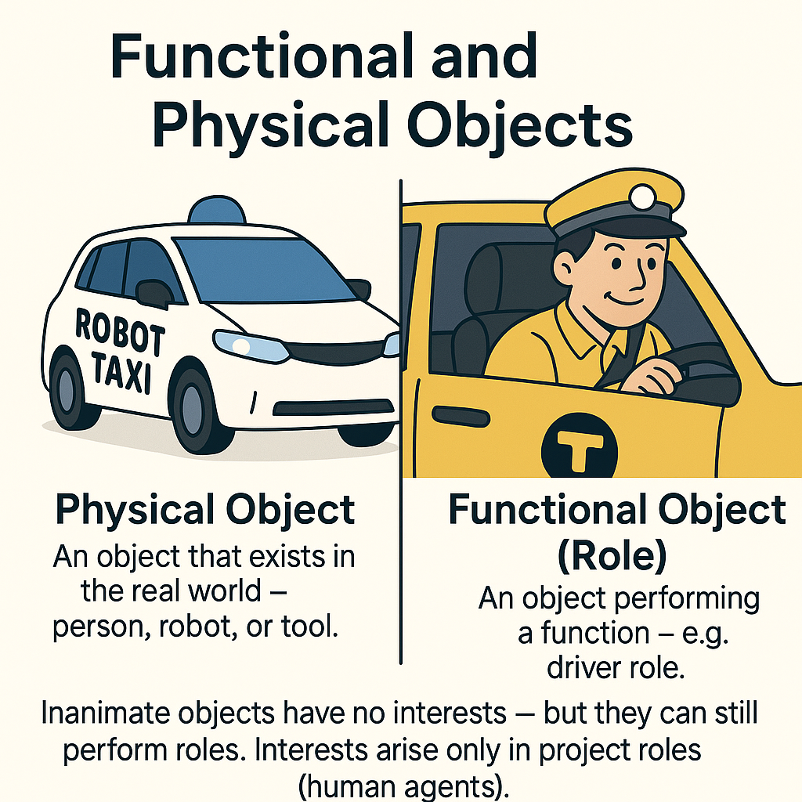

# Physical and Functional Objects

Let's distinguish between a role and a project role.

A project role is always performed by a person or an agent, unlike a stone, which lacks intention. The term "role" can be used not only regarding an agent because a role is a functional object, while its executor/performer is some physical object. This object could be either an agent or a non-agent without intention.

Let's consider the example of a taxi. In a taxi, the role of a driver may be performed by a person or a robot with artificial intelligence (this is a subtle point, and soon we might discuss AI's intentions). In the first case, we'll refer to a project role to emphasize human involvement. But if we say there's a "driver role" in a taxi, we assume the role could be fulfilled by a person or an inanimate object.

It is essential to understand the distinction between:

* physical object: This can be a person, AI, or another inanimate thing. Note that when we speak of a physical object, we indicate that something exists in the physical world. We know nothing about what role this physical object can play^[There's just a stone. It's a typical physical object. Its function isn't clear. If someone wants to do something, they need a specific function. For example, to drive a nail or weigh down papers so they don't scatter. Then we'll talk not about the stone but about functional objects—a hammer and a paperweight. The fact that it's a stone is no longer as important.]. The main point is that when we refer to it as a physical object, it exists in 4D dimensions (three-dimensional space and time).
* functional object: This is the role. In the example mentioned above, it's the role of the driver. When discussing a functional object, we focus on the fact that it’s not just a physical object but a role. Not just a person, but a driver with specific mastery. In this context, we focus on the behavior of the functional object, not on which physical object will play the role^[Combining physical and functional objects will be necessary when creating a system, but we must be able to distinguish these two entities separately with our attention. And be able to discuss them separately.].
* role or functional behavior: We say that a functional object exhibits specific role or functional behavior; thus, the system is viewed as a "black box"^[Here, we're not concerned with the internal structure. More about the system's structure (as a transparent box) will be discussed in Section 6, "System Modeling."]. For example, the role of a driver involves the behavior of driving a car.

This division into physical objects, functional objects (roles), and role behavior is an important technique of using a systems approach.

For instance, initially, we recognize the need for the function of driving nails. The function is behavior. This function is linked to the role of "nail driver," after which a performer is assigned to this role. It won't necessarily be the physical object 'hammer'^[Remember that in culture, instead of "nail driver," people say "hammer." In fact, the term "hammer" has become culturally defined and is widely used, just like the term "driver." Culturally, terms are continuously attached to functional objects. There's no need to say 'operator of a vehicle'; you can simply say 'driver.' Similarly, there's no need to say "nail driver"; you can just say "hammer." Thus, 'hammer' is a functional object, whereas the physical object can be the stone, microscope, or hammer. But here, 'hammer' is understood as a specific tool as a physical object.], which I have in my garage. The desired role of "nail driver" might be fulfilled by this microscope in a lab or a stone I see from my window^[Specifically emphasized here is that it concerns specific objects—the microscope and the stone, not some abstract instances.].

Similarly, engineers design systems. First, they understand which functions are needed, and based on this function-behavior, they name the system, giving it a functional name or role. After that, they determine the modules or physical objects that best fit these functional roles.

The role approach is the same for agents and "iron" inanimate systems when we consider them as performers of specific roles. The agent's behavior is called role behavior, while the "iron" system's behavior is called the system function. Although you can talk about the role behavior of a car, this won't be incorrect either.

However, there are deeper differences. For example, to get a person into the right role, they need to be persuaded somehow, whereas no persuasion is needed to get a microscope to perform the role of a hammer^[More precisely, all "persuasion" is prescribed in formal engineering methods. If calculations are correct, it's impossible for the iron system to dodge the prescribed role.]. Therefore, in systems involving people, leadership practice comes to the forefront. The essence of leadership is to get a person into a role promptly and to perform it well, efficiently, and joyfully. A leader knows how to place a person in a role. The system leadership method is about helping another person step into a specific role. Placing "iron" systems into a role occurs through ordinary engineering methods and based on physical theories.

For example, a person in the role of a manager might impose a penalty on an employee at a meeting for failure to fulfill an assignment, all within managerial practice. However, that same person, in the role of a leader, might hold an open-hearted conversation in the evening to understand what issues the employee faced.

Another distinction is that an "iron" system doesn't have a role interest, which only exists for a project role. To create a successful system, first, identify the interested project roles and then their role interests. Human behavior is conditioned by the concept of "intention," while a role has a "preference."