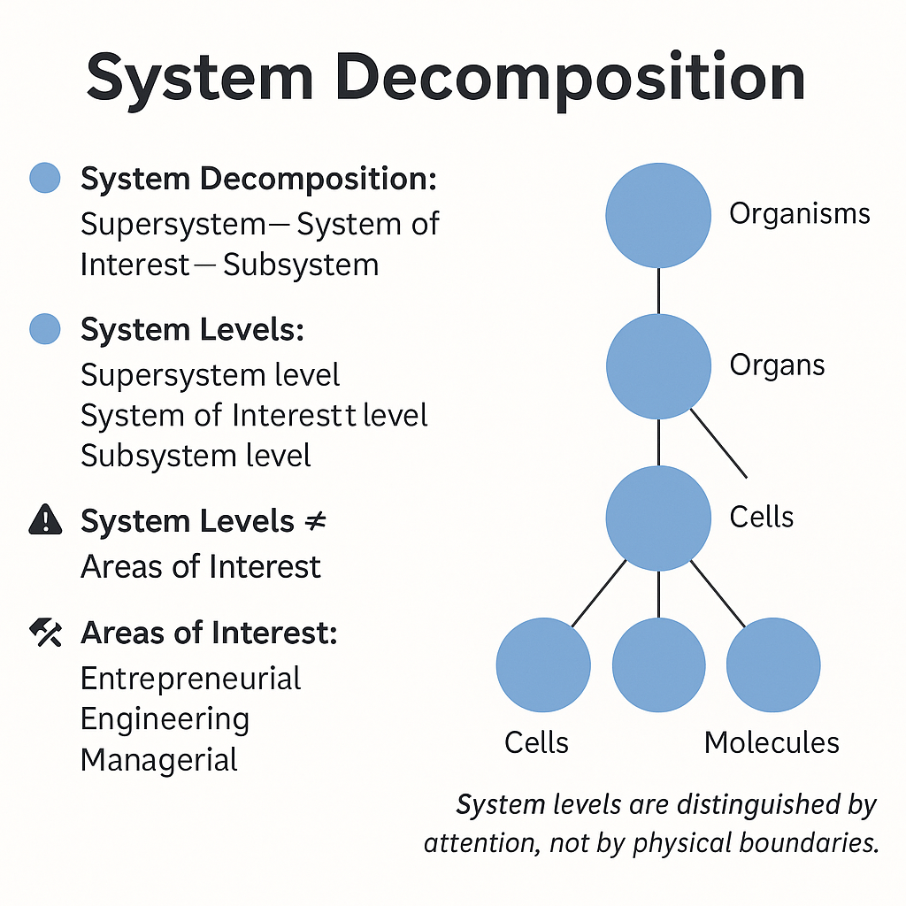

# Systems Breakdown

We have grasped the concept of areas of interest, so now let's discuss system breakdowns and system levels. It is important not to confuse "areas of interest" (of systems and roles) with "system levels."

As you already know, systems can be viewed from different perspectives:

- When a system is a whole for parts within it, that is, a complete system comprises subsystems;
- When a system is a part of a supersystem, meaning the system itself is a subsystem.

Each subsystem is also a whole for its sub-subsystems, and each supersystem is a part of a super-supersystem. Thus, one can discuss breaking down a system into parts from top to bottom or bottom to top. If a system is not planned to be further divided, it is referred to as a "system element," highlighting that there is a whole system of which this subsystem is an element.

The levels within a system breakdown are known as system levels. They are identified using the part-whole relationship. With this, we logically distinguish these levels in the physical world. Of course, no actual level boundaries exist in the physical world; it’s the systems thinker who identifies them by focusing attention.

The classical hierarchy of system levels originated in biology. The diagram shows that cells consist of molecules, yet cells themselves are parts of organs. Organs are made up of cells, but organs are components of organisms, and so forth. A person assuming the role of a biologist decided to divide the world this way and assigned appropriate names to these parts and levels^[Similarly, you will need to determine the names of parts and system levels in your work projects.].

The diagram illustrates system levels – the organism, organ, cell, and molecular levels. However, it does not depict the biosphere level, which is above the organism level, nor the atomic level, which is below the molecular level. This doesn't mean they don't exist—it simply means they aren't shown in this diagram.

The system levels in your activities are also determined as needed. In project activities, a limited number of system levels are typically used; you're unlikely to work with more than 3–5 levels. But ignoring them entirely is not an option, as there is always interaction among levels (misalignments).

Moreover, it's crucial to pay attention to other systems situated at the same system level. One must maintain enough focus to monitor surrounding systems and the physicality of part-whole relationships across multiple system levels up and down. Working without concentrated attention, losing touch with reality, or confusing what constitutes a part and what is a whole can be detrimental to the project.

After fixing the system level, we can then discuss areas of interest. For example, in section 4, we outlined areas of interest for the system level "automobile," making it possible to discuss the interest areas of the supersystem (automobile + driver) and the creator. Similarly, interest areas can be outlined for the system level "engine" or "piston." Different teams work at different system levels and with different areas of interest. When creating a 3x3 Table for a specific system, such as an automobile, we must understand that the table for the automobile differs from the table for the engine and the piston, requiring three different tables.

Note that system levels and areas of interest do not completely overlap^[If you find this confusing, please consult your instructor. Understanding this distinction is crucial for the continued study of the textbook.]. They are distinct concepts applied to a chosen system. In relation to this system of interest, areas of interest and system levels are identified. For example, considering the "automobile" system, the area of interest for the supersystem will relate to "automobile + driver"^[Or "automobile" if creating a 3x3 Table for the "engine" system, or "engine" if creating a 3x3 Table for the piston.]. The interest area of the system of interest will relate to "automobile"^[Or respectively with "engine," or with "piston."]. However, the creator's area of interest will not be encompassed within the system levels of "supersystem – system of interest – subsystem."