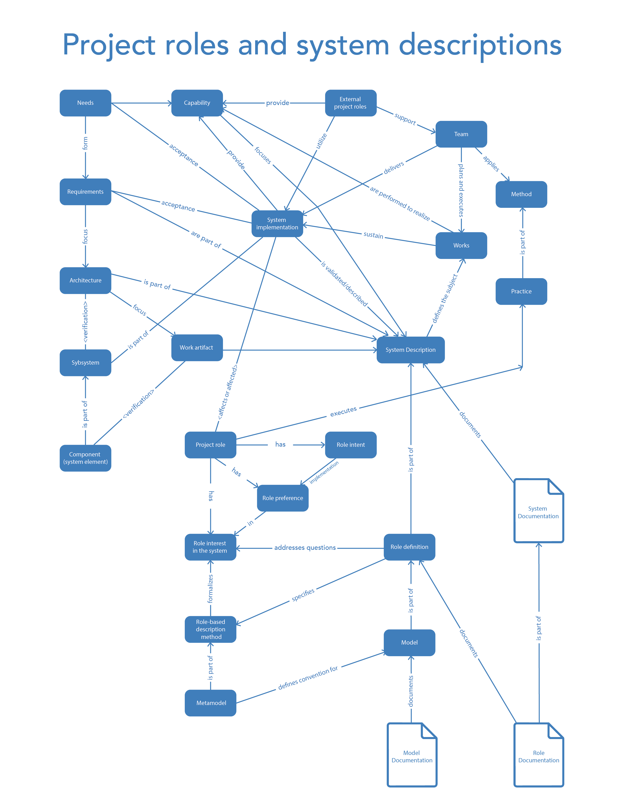

In the textbook "Systems Thinking," a diagram showcases the majority of systems thinking concepts we've already discussed. Proficiency in systems thinking, enabling you to apply it to work projects, means being able to easily see the connections between these concepts. The diagram highlights seven main concepts, known as alphas^[The OMG Essence standard (http://www.omg.org/spec/Essence/) introduces a special type of functional object for tracking changes in the state of a project — alpha (ALPHA or Abstract-Level Progress Health Attribute). Alpha is an object of focus whose functional/role nature corresponds to the area of interest "how the project works" (not the system of interest, but the project, i.e., creation systems). To think coherently about how a project works, how the system of interest is created and then developed by the creators in the course of their work, attention must be focused in the project not on arbitrary objects, but on alphas.], which are colored, while other concepts and sub-alphas are not highlighted. Nevertheless, it is evident that all concepts are interconnected, with most connections leading to the embodiment of the system. This represents our successful system, which is why we study systems thinking with all these system concepts.

It may seem that such an approach is somewhat excessive. But imagine an analogy where you create a basic conceptual network centered around a car. Adults are fluent in the concept of "car," not in terms of a systems approach, but simply as a field of interest. You would likely quickly link concepts like fuel, movement, weather, passenger, environment, luxury, winter tires, and many others that help explain activities related to a car.

You can calmly draw a diagram in which all these concepts are interconnected^[Fuel is poured into a car's gas tank. In this simple statement, I described the physical world using concepts like "fuel" and "gas tank," connecting them with another concept-action, "poured." The fact is, you are familiar with these concepts, and your brain easily connects them and quickly models the physical world. If fuel suddenly starts leaking outside of the tank, you would take specific actions, which can also be described with a particular model.]. For someone from the 17th century, many terms related to a car would be entirely incomprehensible. But you handle these concepts effortlessly because you live among them. Similarly, it is recommended to "live with" the concepts of systems thinking in order to create successful systems in personal life and work projects. Fluent operation with system concepts means quickly identifying them in your project, like the system of interest or method for describing a subject of interest, such as "price" or "safety"^[Just as in everyday life, you fluently use the concept of "mom" and "dad," and when visiting a friend's house, you quickly understand who is who.].

The use of system concepts is necessary to compose (model) systems descriptions required for creating successful systems. It involves creating descriptions for all areas of interest of the supersystem, the system of interest, and the creator.

In this section, we will focus on the following:

* how to describe any systems using systems language, including role descriptions, models, description methods, etc.;
* learning about the four main descriptions of a system as a transparent box, which correspond to the internal workings of any system;
* understanding the types of documentation required for the areas of interest of the three kinds of systems.