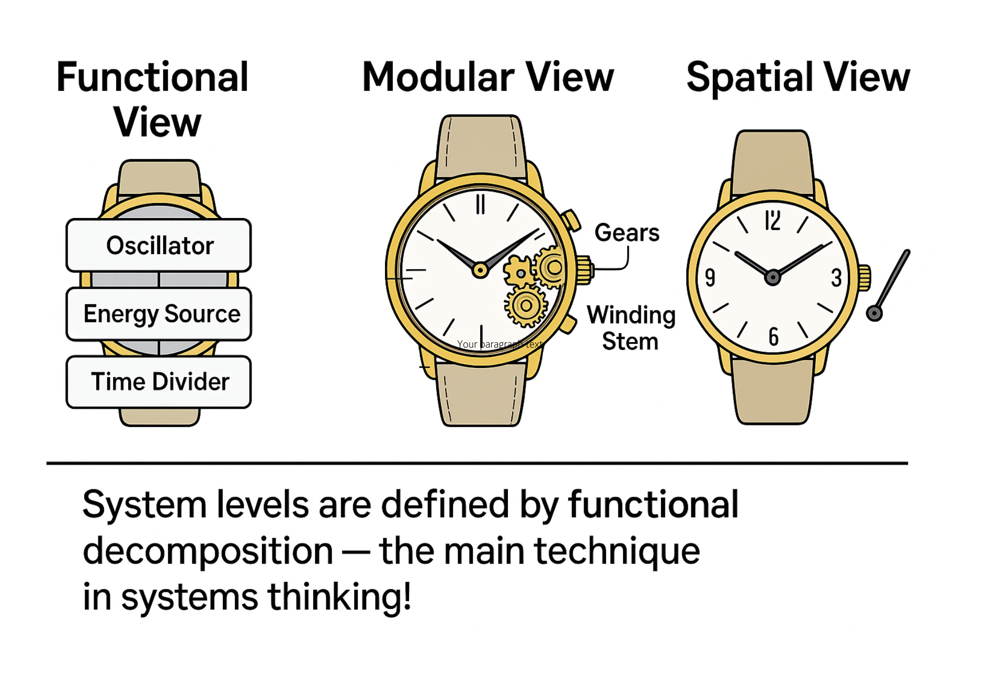

Let's consider three descriptions using the example of a watch^[Image created by A. Turkhanov.].

**Functional Description** - This is an account of subsystems as role-based or functional objects. A functional description illustrates "how the system works internally." For example, a functional diagram demonstrates how a watch operates. Note that on this diagram, there are no modules, as the focus is on the watch's functional parts. These parts exhibit their functional or role-specific behavior.

**Constructive or Physical Modules** - These are objects assembled into the watch system. A modular description or modular breakdown illustrates what the system is composed of. As you can see, the modular scheme indicates many constructive parts of the system. It does not clarify the working principle of the watch, but it shows clearly how to assemble a watch with gears, springs, hands, and other modules.

**Spatial Description** - This third description focuses on the placement of system parts in space. It is essential to know where in the universe the system's parts are located. This is spatial decomposition. Without knowing the exact placement of modules, the system won't function.

**System Levels** are defined by the functional breakdown—the principal aspect in systems thinking! Therefore, functional decomposition is often referred to as systemic. What about the others? These are conventional breakdowns. And, of course, let's not forget there are also modular and spatial breakdowns.

As you can see, all systems at each system level interact with each other as functional objects. This interaction is described by the functional diagram. At the same system level, you can identify specific physical objects that perform these functions (or play the role of functional objects). These physical objects are located somewhere in space. If we move to another system level, everything will be similar there too.

For example, we can identify functional and physical objects and their placement at the subsystem level of an engine. Then, we can identify functional and physical objects and their placement at the level of the entire vehicle. Here, we will not consider the engine's structure; it will be part of the car system. However, you can view the engine system from a functional perspective—this functional object must deliver torque^[In culture, the functional object of the engine system is usually called the engine. This is a role, whose function is to move. Internal combustion engines move by transmitting torque to the chassis.]. You can also view the engine system as a physical object—it would be the BD-1324 gasoline engine. We can ascend yet another level, where there will be other functional and physical objects and their placements.

The next example relates to the system of the human constructor, who can create successful systems in various projects. The constructor exhibits functional behavior—life mastery. Life mastery consists of the following functional parts:

- thinking mastery or intelligence;
- applied mastery.

Another example concerns the functional parts of the car system. These would include the chassis, body, and engine. Here, in turn, you can perform further system breakdown and examine the structure of the chassis, thus highlighting the next system level.