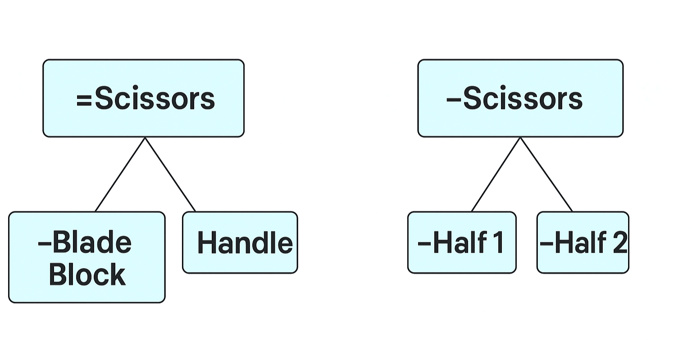

# Main Descriptions of the System as a “Transparent Box”

In systems modeling, we always begin by focusing on the area of interests of the supersystem[ ^1 ] — identifying external project roles, their needs, and subjects of interest. Only then do we move to the arrangement of the system of interest, which we will discuss in this subsection. In the next section, you will learn about the particularities of modeling creation systems.

The system of interest is viewed as both a "black box" and a "transparent box."

The system as a black box is described through role behavior and function, subjects of interest, capabilities (needs), and external project roles. A system as a "black box" can be described as either prospective[ ^2 ] or as existing[ ^3 ], but in both instances, attention must be paid to the following descriptions of the system:

* as a functional/role object and its behavior in interaction with the surroundings during operation;
* as a constructive object that is represented in the physical world and occupies space during operation;
* as the total cost of system ownership.

Note that from these descriptions of a system as a "black box," a description of the system as a "transparent box" emerges. The internal description is an inherent consequence of the external. For example, in section 3, we discussed the role of the architect, who determines the constructive (modular) arrangement of the system, based on the architectural subjects of interest in the system.

In this subsection, we will discuss how the internal structure of the system (the "transparent box") is described. The conditional "division" of the system into parts can be done in various ways[ ^4 ]. Here are four main types of system division and corresponding descriptions, using the example of the "teapot" system:

* One person might be interested in the functions of the parts during operation and will say that a teapot consists of a container, a pouring spout, a filling hole in the container, a handle on the container, a lid, and a handle on the lid, plus a steam release hole in the lid, otherwise closing the wet lid will cause water to splash from the spout. This is the so-called functional description of the teapot system, and the description of subsystems as role (functional) objects is known as system breakdown.
* Another might say that the teapot consists of just two parts in its construction that need to be manufactured, because their interest lies in the manufacturing time of the teapot. Here the subject of interest is in the construction, specifically "what to manufacture" or "how to assemble." This is the modular (product) description of the system.
* A third person might say that the lid and the teapot should be kept together, and it would be better if the lid were directly on the teapot. This is an interest in placement, meaning "where in the universe the parts of the teapot are located." This is a description of locations or placements (spatial description) of parts within the system.
* A fourth person might discuss the cost of parts of the teapot, meaning what will require expenditure of money and other resources. This is the cost description, which is part of the description of the total ownership of the system as a "black box."

Systems thinking involves many descriptions of a system. However, four main types of descriptions or perspectives on the division of a system into parts stand out[ ^5 ]. The main decisions about the system's arrangement are called the system concept. Typically, the system concept is not created all at once; it gradually accumulates details until the description of the system is sufficiently precise for its manufacture on a production platform. That is, the system concept is "alive," and it changes during development, with the system continuously being modified even after operation begins.

In order to create each of these system descriptions, it is necessary to know a specific practice or method of description. Using this method, a specific work artifact is obtained. For example, earlier we provided an example that through the method of management accounting description, a financial description of the enterprise system, which interests the manager, can be obtained.

Note that all these descriptions do not coincide. It is particularly challenging to notice the discrepancy between functional and modular descriptions. Usually, developers determine the primary function of the system and look at the system as a functional object consisting of functional subsystems. The architect, in turn, determines which constructive modules (executors) will play these roles. The coincidence of functional and modular parts does not necessarily have to be 1 to 1, and the names of these parts can differ. Consider the example with scissors, where the functional parts are the blade unit and handle, and the modular parts are half 1 and half 2.

In system projects, functional analysis occurs, meaning division into parts (analysis is division), and modular synthesis, meaning assembly. Be cautious of projects where it is unclear who makes synthesis decisions. In such projects, analysts usually work, but they do not change the world. Synthesis and decisions about synthesis change the world!

Thus, a person using a systems approach can examine the structure of any system as a "transparent box," highlighting at least four subjects of interest:

* functional=role=analytical[ ^6 ];
* modular=constructive=synthetic;
* spatial=location=placement;
* cost=economic=resource-related.

[ ^1 ]: One of the skills of systems thinking: the first focus step is always outward from the boundary of the system of interest, and the second step is inward into the system.

[ ^2 ]: This refers to design in terms of modeling what kind of system is needed in the supersystem. This is straightforward engineering.

[ ^3 ]: Or reverse engineering, meaning describing an already functioning system if such a description is unavailable but needed for some purpose. This is "reverse engineering."

[ ^4 ]: If different people look at a kitten, they will see it differently. A veterinarian will see the biological structure of the kitten, while a grandmother will see a warm, furry object. A system can be divided by the materials used (metal, plastic, glass, etc.), the color of the parts (black, white, or colored), or the shape of the parts (round, square, etc.).

[ ^5 ]: For example, recently, the subject of interest in what work is done with the system parts has started to be highlighted additionally.

[ ^6 ]: Typically, analysis or breakdown into parts is done to understand the structure of the system. Analysis helps understand the functional parts of the system. Synthesis or assembly is connected to the procedure of assembling the system from physical models. Therefore, there is often talk of functional analysis and modular synthesis. Both analysis and synthesis must be conducted. One cannot be engaged in only one.