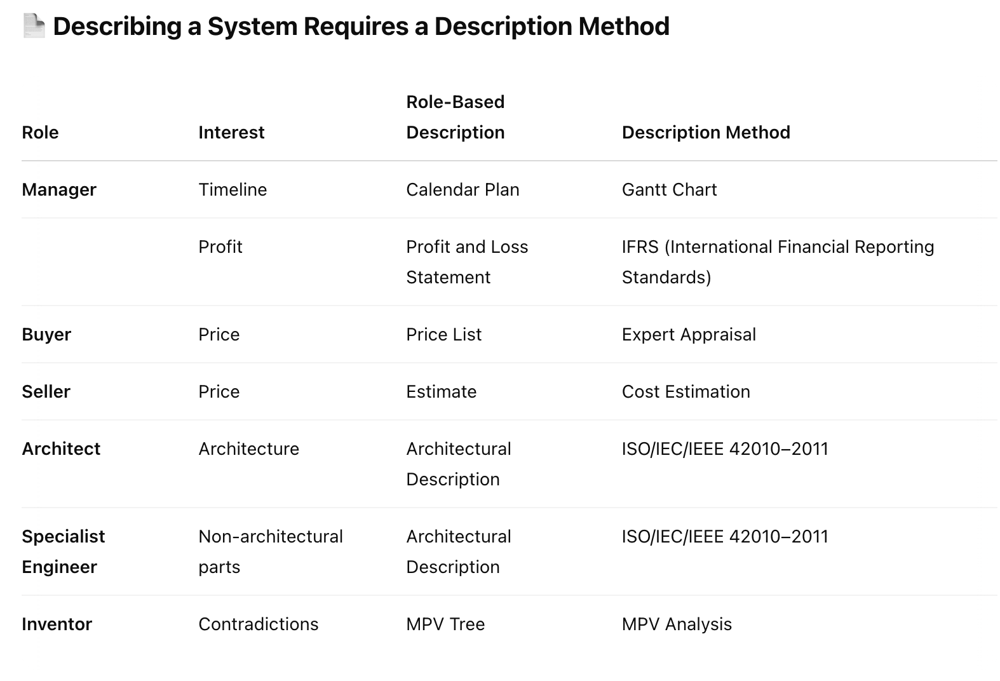

# Method of Description

You already know that a system description consists of role descriptions, which in turn consist of models. To create a role description, a method of description (practice) is necessary. A method of description is presented as a theory that explains how to create system descriptions and the necessary tools to produce a work artifact (documentation). The theory provides metamodels, which are filled with data and subsequently become models. Models can exist on various media, such as paper or computer. When this happens, we refer to it as system documentation.

The easiest way to think of a method of description from a substantive point of view is as a set of notations for multi-layered map-models that describe the territory. The territory represents a system, the map is the documentation with the system description, but there's a method for making the map^[For example, the photogrammetric method for creating topographic maps.], which includes metamodels, concepts, principles, etc. The theory for creating this description, alongside the technology of map creation, is the method of description.

The universality of the top-level modeling approach means that the description is made in response to a specific subject of interest (or preference) for a particular system, and for this, a role (roles) uses a certain method of description, which results in documentation addressed to another role. For instance, a topological map is created in response to the interest "relief" of the system "territory" (of some area). The map is made by topographers and used by surveyors, geologists, or geographers, and perhaps by designers who are creating a house project.

The method of description allows for the creation of descriptions of any systems. Naturally, one must primarily focus on the system of interest, but in project activities or at an enterprise, you will encounter numerous documents describing a wide variety of systems (supersystems, subsystems, creation systems, etc.).

In the table above, you see the connection between the concepts of role, interest, role description, and method of description. Note that you may have often seen such role descriptions in the form of documents. Many of you are proficient in various methods of description, through which you create specific documents. Be sure to describe your roles, methods of description, and work artifacts in the corresponding exercise on modeling within the course.

Different roles may have the same interest, but different role descriptions. A single role may have multiple interests. In such cases, it is possible to create one description that addresses several subjects of interest.

It is crucial to choose the right methods of description. For instance, tax, financial, and management descriptions require different methods. For tax purposes, tax and accounting methods are needed; for financial descriptions, IFRS (International Financial Reporting Standards) or US GAAP are used; and for management-financial descriptions, managerial accounting methods apply. Note that all three descriptions (methods and work artifacts) are created for three different roles—for the tax auditor, shareholder, and manager.

You already understand well that it is impossible to make quality role descriptions if the role method of description and the corresponding documentation are not considered explicitly. That is, they cannot be done unconsciously. Awareness in applying the method of description increases the likelihood that you will notice the need to master a new method in time.

[ ^1 ]: For example, the photogrammetric method for creating topographic maps.