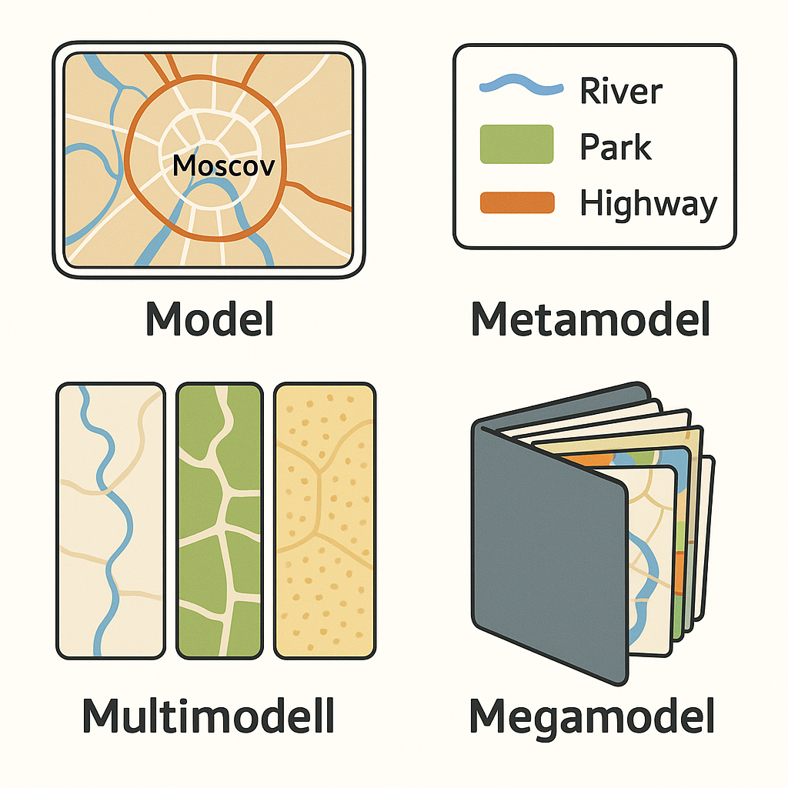

# Models, Meta-Models, Multi-Models, Mega-Models

You are already aware that modeling results in models which can exist on various physical media. A model helps make judgments about the object being modeled. The object being modeled is the system of interest and other types of systems. Models also pertain to the supersystem, creation systems, surrounding systems, or subsystems.

Let's emphasize once more that models are created using a specific method of description. It is this method that indicates what is most important in the object being modeled and what needs to be considered in the models. This "most important" aspect for any given model is referred to as a meta-model.

For example, consider the system—a city like Moscow. A map of the city serves as a model of Moscow. The map's legend acts as a meta-model. The map contains a minuscule portion of information about the city, but it is deemed the most critical information that someone decided to depict. One map might show city districts, another may display roads and industrial enterprises, while a third might represent water conservation zones, etc.

Each map's legend indicates what is significant on these territories and what must be displayed in these specific models. You will see the road on the map because it's important, but not its width, as it was not essential for the creator of that particular map.

A collection of interrelated models, created using different descriptive methods, is usually called a multi-model. It's akin to a collection of various maps of the same territory: flora, fauna, population density, terrain, road networks, etc.

Besides the set of maps, we also need a set of legends for these maps. A multi-model along with its defining meta-models is referred to as a mega-model.

For more detailed information on models, meta-models, multi-models, and mega-models, refer to the "Systems Thinking" textbook. It's beneficial for broadening your horizons. Moreover, it is necessary to apply these concepts in project activities.

Errors in a system model should ideally be identified (and corrected) during system description and documentation, that is, before manufacturing—not afterward, and certainly not during the system's operation. As the saying goes, measure seven times, cut once!