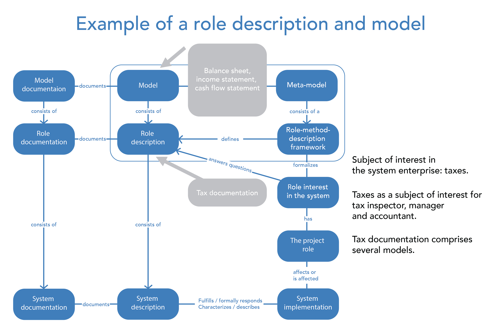

# Role Descriptions and Models

In the first section of the course, it was mentioned that a system possesses certain classical properties and is influenced by design roles. We then discovered that there are numerous subjects of interest to the system and that each description is created for a particular subject of interest.

In the adapted diagram from the ISO 42010 standard [ ^1 ], you can see how to contemplate interests in the system, design roles, role descriptions, models, and so on. This international standard provides guidelines on how to think about system descriptions.

The standard itself addresses only architectural description, but its principles can be applied to any description of different systems. For example, apply this scheme not to the system of interest but to the creation system.

In practice, everything usually begins with identifying a role-specific type of description, which stems from a particular interest. For instance, an enterprise has a subject of interest—taxes. There are specific design roles (each with its own methods and work artifacts) that hold this subject of interest. However, the preferences regarding this subject of interest may differ among the tax inspector, manager, and accountant.

To address this subject of interest, a tax description is formulated, which must include all the preferences of the design roles. Each design role has its own demands, but to reach an agreement, a common description for all interested [ ^2 ] design roles must be established.

It consists of specific models. Discussing tax issues is straightforward because many metamodels are regulated by the state in appropriate normative documents. These are documents such as the "Balance Sheet," "Profit and Loss Statement," and others. When these metamodels are populated with relevant reporting data, they become models—descriptions of a specific enterprise and its economic activities.

As you may have guessed, there is a defined method of description used to compile this tax description. This is the method of accounting and tax reporting.

The state is concerned with taxes, thus promoting its subject of interest through the normative affirmation of description methods (metamodels) and meticulously reviewing the models presented by accountants. Take an example from tax inspectors in how much attention needs to be paid to modeling.

However, on the other hand, you must never forget that ultimately you need an implemented system, and the description given to us in the form of models, drawings, manufacturing instructions, etc., is necessary only because, without description, it is very challenging to bring a functioning system to life.

[ ^1 ]: Refer to the textbook "Systems Thinking" for more details about this standard.  
[ ^2 ]: That is, those who have the same subject of interest.