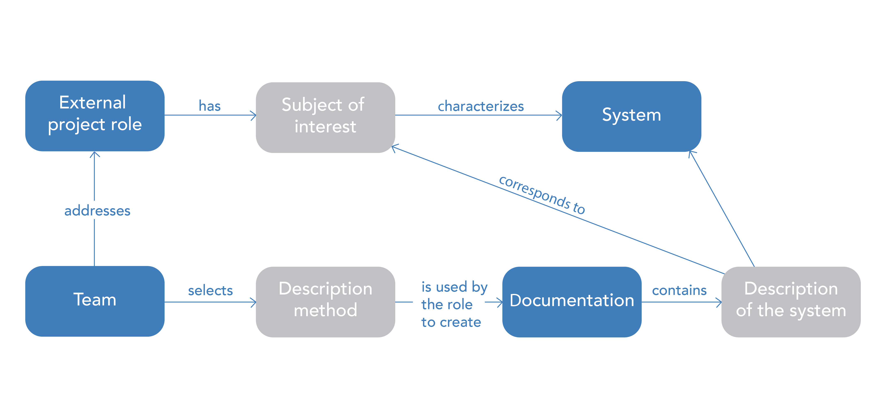

# The Connection Between Description Method, Subject of Interest, Project Roles, and System

In previous sections, we discussed that a subject of interest is connected to a system. A system can be characterized by various subjects of interest. These subjects of interest are associated with project roles, meaning that people in these roles are concerned with certain system characteristics.

The team determines which interests of the project roles [ ^1 ] will be addressed during the system's creation. This directly influences the work artifacts (documentation) needed. Work artifacts are physical carriers containing a system description that responds to a specific subject of interest.

In order to create the documentation, one must possess a certain practice [ ^2 ] or method of description. This method of description, applied to a physical carrier, produces a system description that answers the subject of interest concerning the system.

For example, a racer's interest might be the speed of a race car. Alternatively put, the external project role "racer" has a subject of interest, "speed," in the system "race car." The developers decided to satisfy the racer's interests, meaning the team concluded that the interests of this project role should be addressed. This means that further work will continue with this subject of interest, within which documentation (a computer model) will be created.

Next, the developers choose a method of description to create the system description. They choose one of the description methods that allows building a computer model for calculating a vehicle's speed [ ^3 ]. This model within the computer is a work artifact that contains a description of the race car system in relation to the subject of interest, speed.

Incidentally, this model may consider other subjects of interest as well. The total number of work artifacts (documentation) regarding system descriptions is proportional to the number of subjects of interest, and the number of subjects of interest is proportional to the number of project roles the team has decided to satisfy [ ^4 ].

[ ^1 ]: From all considered project roles, the subjects of interest and/or preferences to be satisfied are selected. It is impossible to satisfy all interests due to limited resources (funds and time); however, the team must avoid making a fatal error. A fatal error may occur if a significant interest is overlooked, leading to substantial and irreparable costs.

[ ^2 ]: As you remember, a project role creates a work artifact through practice.

[ ^3 ]: Both the theoretical aspect of the calculations and the computer-based part of how these calculations can be performed are important here.

[ ^4 ]: All project roles are taken into account, but the team may decide that only selected roles will be satisfied. For each of these, a work artifact is created to satisfy the project role. The diagram shows only the external project role, but the same applies to an internal project role.