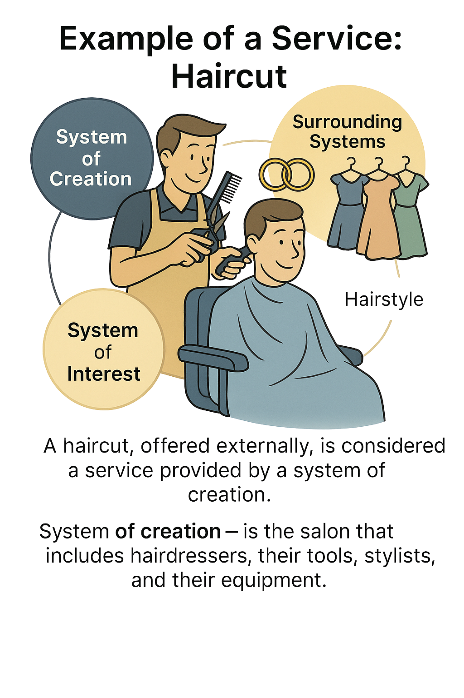

# Example of Service - "Haircut"

Let's consider an example with a hair salon. A hair salon belongs to the service sector. It does not produce systems-products in the way an automotive factory does. If you ask anyone what a hair salon does, they will answer that it cuts hair.

Thus, a hair salon provides the service of haircuts. It offers an outwardly standardized set of actions: a Canadian cut, a model cut, and so on. When we talk about a hair salon, it's appropriate to speak in terms of "service" and "offering."

However, a hair salon is also a system-enterprise, which means it has a system of interest created by the salon as a creation system. This system of interest is the hairstyle. The supersystem for a hairstyle is a well-groomed head or a lady ready for a night at the theater. Further, surrounding systems include makeup, earrings, and a dress.

Not the entire hair salon participates in the haircut service, so it's more accurate to name the parts of the enterprise directly involved in this procedure. This includes the hairdresser and all their tools (technologies) such as scissors^[In turn, scissors also provide a service—cutting.], clippers, combs, etc. Essentially, there is an internal process involving the hairdresser with scissors, and an external service delivered as a result of this internal process. A system constructor may discuss them separately, which is why there are different terms—process, service, systems.

A system like scissors is created with a specific functional purpose. The creators of scissors must clearly understand the intended or requested function by the client^[The creators of scissors adhere to the principle: "the finger presses against the table, but the table does not press the finger," meaning scissors are the active object interacting with hair, which is considered passive. The interaction of hair with scissors is typically neglected in this functional (role-specific) consideration. An alternative view can also be taken. Attention cannot simultaneously capture all interactions and influences. More details about why systems thinking adheres to Aristotelian rather than Newtonian physics can be found in the section 'Aristotelian Physics in Systems Thinking' of the 'Systems Thinking' textbook.]. It's one thing if it's a hairdresser, another if it's a gardener. While the principle of operation remains the same, hairdressing scissors are made for the former, and pruning shears are made for the latter (garden shears).

If this example isn't clear to you, be sure to reflect on it using thinking through writing. Also, write down questions you can ask in the support chat for the "Systems Thinking" course. For those who understand this example, try to come up with a similar one.