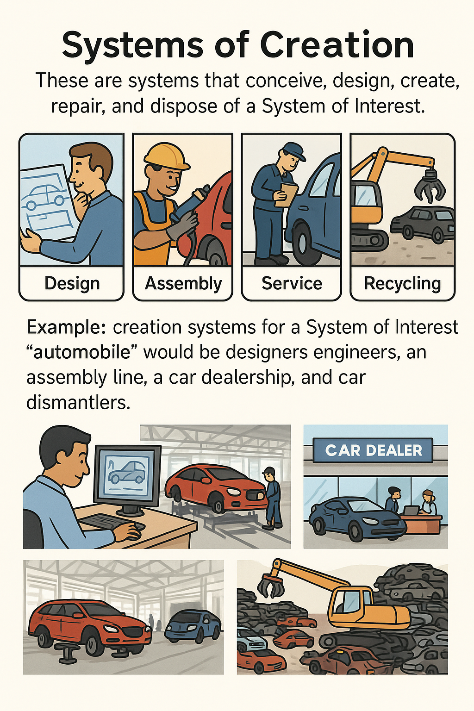

# Systems of Creation

Any activity becomes significantly more productive when you understand its purpose. From a systems approach perspective, one can assert that the purpose of any activity is to create a system of interest. Consequently, creation systems will engage in activities to materialize this system of interest in the physical world. This constructive activity is typically termed a project, process, program, and so on. It's important not to confuse the types "project" and "enterprise" (or "expanded enterprise") because the former is an activity, while the latter is a system.

For instance, the goal of the creation systems' activity could be the system of interest—a Mercedes E-Class vehicle. Factory operations represent a process involving specific creation systems, such as those responsible for assembly.

Creation systems are those that support all stages of system development, from conception to disposal. In our example of the system of interest "automobile," factory operations involve designers, component suppliers, and assembly lines. However, creation systems also include service stations and car disposal units, which may not necessarily be part of an automotive corporation. It's rare for all creation systems to belong to a single enterprise, which is why we refer to the expanded enterprise.

An important note regarding creation systems is that one should not label an activity as a system of interest. Firstly, activity is not a system (neither the system of interest, creator, nor any other). Secondly, when you observe activity, it is likely the activity of some creation systems working to create a specific system (whether it’s the system of interest or ours). It's more accurate to first determine the purpose of the activity. It's highly probable that it aims to create a system. That system is likely to be the system of interest, whereas what you're engaged in—such as factory operations—will just be the activities of some creation systems.

Additionally, it's not advisable to call a factory a system of interest. The system of interest is likely the factory's product. Therefore, it's essential to always ascertain what the factory produces. A factory producing irons is entirely different from an automobile factory. The system of interest defines what the creation systems should be like. Therefore, first understanding what the enterprise produces will help to better comprehend how it should be structured. In other words, the kind of factory needed depends on the factory's product, which will be the system of interest.

Only after that can you transition to another project, where the creation system becomes "our system." Often in project activities, while considering the system of interest "automobile," you also need to construct a factory (hire and organize personnel) that will produce this automobile. In such cases, it is necessary to manage your focus, differentiating between these two considerations.