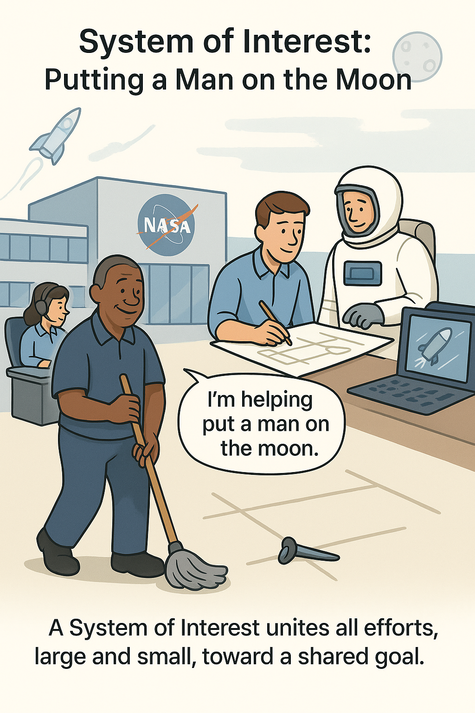

# System of Interest and Collective Systems Thinking

The system of interest is shared by the entire team or members of an extended enterprise! It is essential for managing collective activities, especially collective attention. Thanks to the concept of the "system of interest," every team member understands that they are part of a significant endeavor and their individual output contributes to the work of the entire team (teams within the creation systems). However, each individual in a role or an enterprise unit may have its own system that they create or develop, known as "our system."

The system of interest focuses the attention of a large system-creator team on a single, unified task. Consider the story of how, in 1962 at NASA's space center, President John Kennedy asked a janitor with a mop what he was doing. "Mr. President," the janitor replied, "I'm helping to put a man on the moon." For the janitor, "our system" would be a clean floor. He literally creates this using a mop, bucket, and rag.

Similarly, in a large corporation like BMW, numerous teams are engaged in creating engines, a production line, a factory cafeteria, and so forth. However, for all of them, the shared system of interest is the "automobile." Meanwhile, "our system" for each team would be the engine, the conveyor line, and the cafeteria, respectively.

Selecting the system of interest is a subjective decision, made by the entrepreneur [ ^1 ], referred to here as the visionary. While many team members may participate in gathering information, analyzing, and deciding, the final say about the system of interest lies with the visionary. It is the agent in the role of visionary who puts their "stake on the table." Many other decisions are influenced by this choice.

For example, Henry Ford, as an entrepreneurial visionary, decided that instead of a horse-drawn carriage, a self-propelled vehicle was needed [ ^2 ]. Engineers then thought about how this system should be structured. Systems are created collectively, involving numerous roles. The final structure of the system of interest (its design, function, internal organization, etc.) depends on considering all stakeholders, not just the visionary. However, there is no guarantee that the system of interest is chosen correctly. This is entrepreneurial work: it requires hypothesizing and testing. It involves taking entrepreneurial risks.

Systems thinking simplifies this process, although it doesn't eliminate the necessity of proposing entrepreneurial hypotheses. Nonetheless, it helps avoid obvious mistakes. For example, systems thinking would require verifying that the system of interest is indeed physical, not mere documentation or something that changes nothing significant in the physical world. It also draws attention to the supersystem, issues of the target audience, the needs of external project roles, and other work artifacts across various areas of interest. Essentially, systems thinking offers a kind of checklist, and although it doesn't guarantee the success of the system of interest, it does protect against novice mistakes [ ^3 ].

It's important to note that most employees work on projects where the system of interest has already been identified [ ^4 ]. Someone in the role of visionary previously selected the system of interest and initiated a project for its creation, modification, and improvement. Beginners in systems thinking must practice identifying the system of interest in existing businesses before taking on the role of visionary [ ^5 ] and independently defining the system of interest in their work and personal projects.

[ ^1 ]: The word "entrepreneur" carries various meanings, so it's always best to clarify.

[ ^2 ]: Note that a term for this system may not yet be established.

[ ^3 ]: And such novice errors are most likely to occur when dealing with something new, complex, and unfamiliar.

[ ^4 ]: Although often projects progress extensively without many understanding the system of interest, it still exists—team members may merely be unaware of its presence.

[ ^5 ]: And you will have to perform the role of visionary, at least in personal projects.