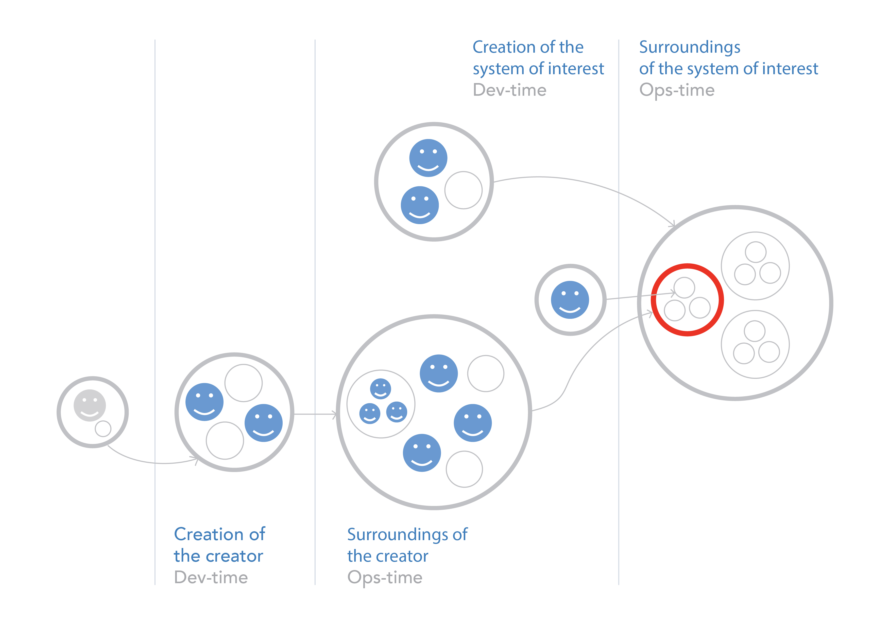

# The Essence of Systems Thinking

By understanding all types of systems, you can be quicker than others in deciphering any complex activity. You can essentially dissect the world with your attention, identifying specific systems. The world is complex, and all its elements are interconnected. The human brain struggles to grasp all connections, so systems thinking establishes principles for logically dividing the world into parts. It becomes much easier to understand each part individually while maintaining its connection to the whole.

For example, on the left side of the diagram from the "Systems Thinking" course [ ^1 ], you can see the system levels in relation to the system of interest, indicated by a red circle. At the top level is the supersystem (the large circle containing the red circle), within which is the system of interest (the red circle) at the same system level along with two surrounding systems. At the system level inside the system of interest, we see three subsystems. This diagram suits our example of a car quite well. Try to associate a car with its subsystems, driver, and passenger.

Beyond the dotted line lie numerous creation systems. Some of them create the supersystem, others are involved in creating the system of interest, and others participate in creating subsystems. This diagram can be used to discuss not only cars and factories, but also systems that build factories. Of course, such complex diagrams are not always needed, but it's important to understand that systems thinking aids in considering the most complex systems and activities. Try using this diagram to analyze your organization's activities. I must say, it will be quite challenging. We delve deeper into students' cases during teacher-led workshops.

[ ^1 ]: You will explore this diagram in greater detail when describing your activities and identifying the relevant systems.