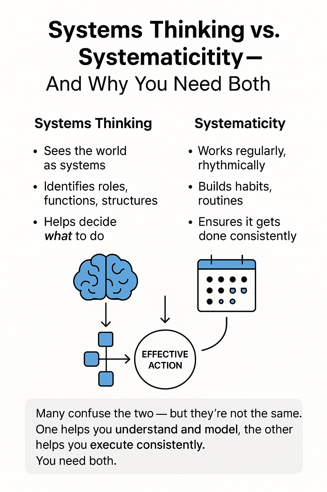

# The Use of a Systems Approach or Systems Thinking and Systematicity 

Most people operate with a "colloquial" understanding of the concepts of "system" and "systems thinking." They interpret 'the use of a systems approach or systems thinking' as mere personal organization, diligence, and the desire to anticipate every possible detail. That is misguided!

'The use of a systems approach or systems thinking' is often confused with 'systematicity'—and systematically poor or incorrect thinking leads to disastrous results. Although many dictionaries define the use of a systems thinking or systems approach and systematicity as synonyms, we will differentiate between these concepts. Systematicity, regularity, and discipline mean that a person does something consistently, according to schedule, while the use of a systems approach or systems thinking means that a person can use their attention to "cut" the world into different systems and work with these systems and the varying interests of people. This is a distinct cognitive (systems) technique that requires systematic training.

The use of a systems approach indicates "what to do," while systematicity suggests that it should be done regularly, continuously, rhythmically. One concept does not replace the other. It is necessary to be both systems-oriented and systematic. This course discusses the use of a systems approach or systems thinking, while systematicity is covered in the course "Practices of Self-Development."

It is widely known that in the world, all things are interconnected, yet the use of a systems approach or systems thinking is not solely about ensuring no detail is overlooked. It's about distinguishing what is important from the general background and integrating important elements into the broader context. Systems thinking directs the focus of specialists or teams in project implementation. Objects of attention are designated by specific terms [ ^1 ]. Using these terms, we distinguish important elements and contexts with our attention. Therefore, our course:

- introduces several dozen such system concepts;
- teaches thinking techniques and corresponding systems modeling that connect these concepts;
- develops the skill of identifying these concepts in work and personal projects.

Here are two systems thinking techniques that will be explored in the course among others.

The first technique emphasizes that any activity can be viewed through three interconnected areas. These should answer the following questions:

1. Why, for whom, and what needs to be accomplished, and how will their behavior change if something new is offered?
2. What is this new element in terms of the product (system), what are its characteristics, how is it structured, and from what is it to be created?
3. Who will create the system, and how, including which methods and resources will be used?

The second technique involves the connection between analysis and synthesis or distinguishing the functions and structure of a system. In corporate culture, a lot is said about analysis, and rightly so. However, it's important not to forget that analytical activity is only a part; synthesis is also needed. Analysis is the breakdown into parts, while synthesis is the combining and creation of the work artifact (system). Systems thinking employs both functional analysis, which divides systems into functional components, and modular synthesis, which assembles a complete system from structural parts. The work artifact or physical structure is what is new, changes behavior (alters the world), and is what people pay for.

Considering the above, you need to prepare for the fact that many of your current ideas will conflict with the methodology of systems thinking. If you work with these misalignments through thinking through writing (modeling), your worldview will significantly update by the end of the course. 

[ ^1 ]: At the beginning of the previous subsection, such concepts were listed: roles, methods, work artifacts, systems, architecture, etc. In this course, we will study several dozen systems thinking concepts.