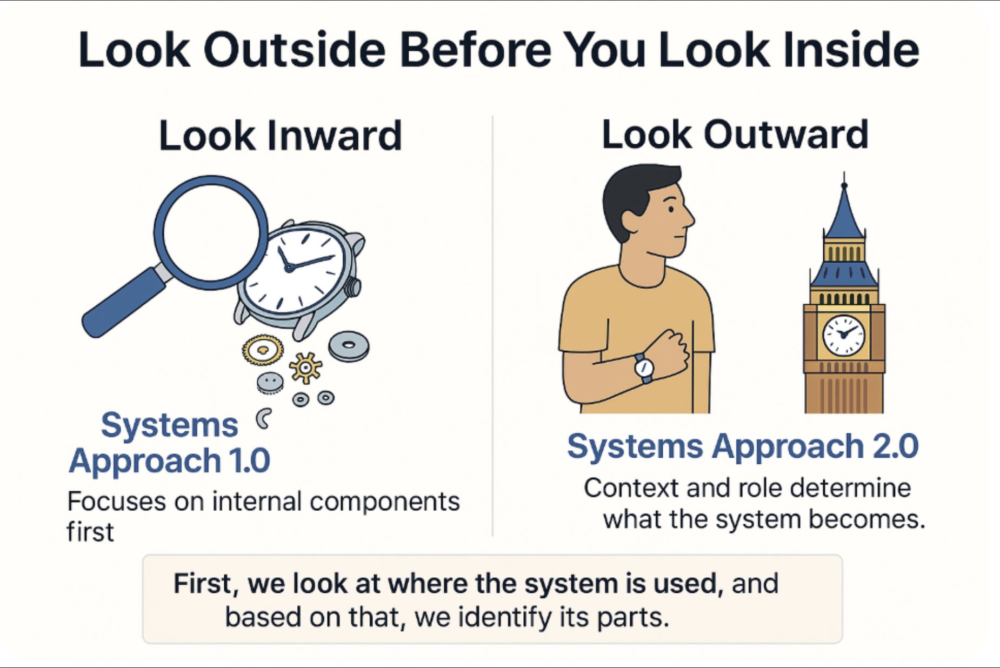

# Systems Approach 2.0

In the classic systems approach, systems were considered material objects possessing three properties: integrity (of a system), emergence, and nestedness [ ^1 ]. However, these systems were viewed as ideal physical objects, disconnected from human interests. Human interests became relevant in what is known as Systems Approach 2.0, based on entirely different systems methodologies compared to the first generation [ ^2 ].

Systems Approach 2.0 does not reject the classic system properties introduced in the first generation. These properties are all necessary conditions for a system's existence, but are no longer sufficient. In the modern interpretation, the concept of a "system" acquires new additional properties that emerge from a subjective perspective on the system.

As mentioned earlier, the classic approach is more abstract and considers ideal objects, while the second-generation systems approach is pragmatic, dealing with objects that are needed by someone or that somehow affect specific individuals.

Systems Approach 2.0 is not applied when discussing an abstract project involving just a table, a clock, or a car without real context. This resembles ideal objects in a mental space, often disconnected from the concrete physical objects required by particular people in specific projects.

Systems thinking emerges when discussing systems like "office desk," "wristwatch," or "passenger vehicle." In this instance, one can at least address the interests and involved roles that expect something from these systems. This perspective helps to define the system, its boundaries, and how it will be utilized.

In Systems Approach 2.0, all project roles influencing the system or people in specific roles that the system might affect are recognized as stakeholders. The totality of all project roles' interests determines what the system will be, its function, what it will consist of, etc.

The thought process involves the idea that "No interests—no system." For instance, an automotive corporation develops a passenger vehicle taking into account the potential interests of drivers, passengers, users, owners, pedestrians, regulatory bodies, environmental advocates, etc. Whether it's a passenger or a commercial vehicle, its engine type, or its load-bearing capacity depends on stakeholder interests.

Every considered interest shapes what the vehicle should be. Without an environmental interest, there would be no need to install an exhaust gas cleaning subsystem meeting Euro-6 standards. Including such a subsystem transforms the system's structure.

Everything installed in a passenger vehicle addresses some project role interest that the automaker decided to consider. The system "passenger vehicle" will be successful if all stakeholder interests (project roles) are addressed (satisfied).

Let's further discuss a systems thinking approach: first, look "outside," then only after that "inside" the system.

The interaction between a system and project roles determines its boundary (integrity), function, and structure. Therefore, discussing a system starts not with its internal structure but with an understanding of its environment. This means identifying which supersystem the system belongs to, who needs it, what these stakeholders require, and what problems and interests they have regarding the system. This leads to an essential system principle: always begin by looking outside the system, then proceed inward.

For example, in a classic examination of the system "clock," a person might focus on the system's properties internally, discussing its components. In modern consideration, it's necessary to begin by looking outside the system, examining which supersystem the clock is part of, who needs it, and how it is used.

This perspective allows for an understanding of whether the discussion concerns a wristwatch, a cuckoo clock, or a tower clock. The design of each of these clocks will differ. Without listing and understanding stakeholder interests, it isn't possible to discuss the system's structure.

Thus, in Systems Approach 2.0, systems do not just possess properties of integrity (of a system), emergence, and nestedness, but importantly, they depend on stakeholders (project roles). The success of a system hinges on satisfying project role interests, hence the evaluation begins with the environment: first looking outside, and then examining the inside of the system.

[ ^1 ]: Do not confuse "nestedness" and "hierarchy." The latter concept may appear in descriptions of first-generation system properties, but this is incorrect. Hierarchy is a broader principle than nestedness. Nestedness is a specific case of hierarchy; not every hierarchy implies nestedness. For example, a supervisor and subordinate represent a hierarchy, but not nestedness.

[ ^2 ]: In the second, as well as in the first generation of the systems approach, there are various systems methodologies. Each has its own set of concepts and thinking techniques. However, their common distinctive feature is that, besides the concept of "system," each uses the concept of "role," or "stakeholder," or "interested parties." One such second-generation system methodology is the Theory of Inventive Problem Solving (TRIZ).