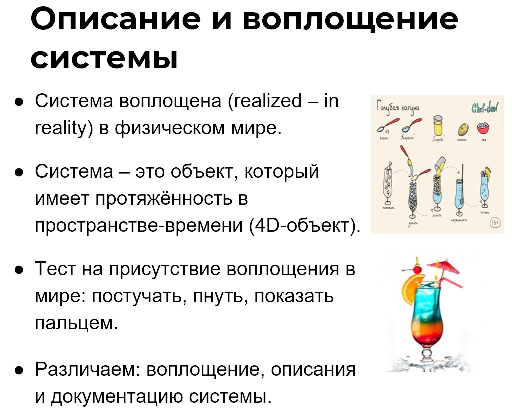

В Школе системного менеджмента курс «Рациональная работа» учит разделять в речи или на письме физический мир и ментальное пространство. Также данный курс тренирует привязку абстрактных рассуждений к физическому миру. Люди не могут обойтись без ментальных понятий, они помогают коммуницировать. Но за словами и знаками нельзя терять объекты физического мира. «Отрываться от земли» особенно не рекомендуется в проектной деятельности, иначе будет сложно создавать успешные системы.

Например, конкурсный управляющий в банкротстве предприятия может заблуждаться и считать, что целью его деятельности является внесение в реестр данных о ликвидации предприятия. Однако, данная запись – это всего лишь информация, которая удостоверяет, что все оставшиеся активы предприятия распределены по кредиторам. Эти активы находятся в физическом мире, они являются целью управляющего и его системой. А запись в реестре лишь описывает данную систему. Поэтому в любой деятельности нельзя путать систему и её описание. Этот прием (и навык) мышления требуется тренировать. Но сначала необходимо хорошо разобраться в понятиях «воплощение системы» и «описание системы».

В системном мышлении понятия «воплощение системы» и «описание системы» относятся к разным мирам. «Воплощение» означает, что речь идет об объекте материального и физического мира, а «описание» подчеркивает, что рассуждения касаются ментального пространства, то есть не самой плоти системы.

В этой связи, правда, понятие «воплощение системы» выглядит тавтологией, потому что, говоря «система», мы и так понимаем, что речь идет о физическом объекте, который воплощен в реальности. Однако слово «воплощение» специально употребляется вместе со словом «система» для того, чтобы противопоставить их словосочетанию «описание системы». Часто, когда говорят про «воплощение системы», параллельно обсуждают и «описание системы»^[Поэтому вы можете использовать просто понятие «система» без слова «воплощение». Но если вы хотите обратить внимание на то, что отдельно рассматриваете систему и ее описание, то можно использовать понятия «воплощение системы» и «описание системы».].

Воплощением системы может быть отдельная система как физический объект. Например, вот этот коктейль «Голубая лагуна» в руках или этот конкретный карандаш. Эти объекты буквально представлены в физическом мире, они существуют в четырех изменениях (4D): длина-ширина-высота и время^[Обратите внимание, что это не абстрактный стул или автомобиль, у которых нет привязки к физическому пространству и времени.].

Когда мы описываем систему, то используем слова-термины, которые определяют её характеристики, свойства, действия, признаки, поведение, состояния и т.п. Возьмем, например, такие термины как цвет, цена, рост, вес, желания и так далее. Эти слова отличаются от слов типа «автомобиль», «стол» или «часы», которыми мы обозначаем физические объекты.

Для того, чтобы описать систему, необходимо владеть определенными методами описания^[Об этом понятии подробнее в разделе 6.]. Для каждой характеристики будут свои картины мира, теории и дисциплины. Если вам необходимо описать цену автомобиля, то необходимо знать практики (методы описания) ценообразования, а если предприятие для акционера, то не обойтись без понимания финансовой отчетности по МСФО или US GAAP и определенной технологии для составления соответствующих финансовых документов (например, SAP).

Описания системы изначально абстрактны. Это понятие необходимо, чтобы обращать внимание на содержательный аспект обсуждаемой системы. Но описания можно привязать к физическому миру, то есть обратить внимание на форму. Для этого нужно посмотреть на носитель информации, на котором будут содержаться данные описания системы. И тогда речь пойдёт уже о документации системы^[Когда говорим про описание системы, мы обозначаем важность содержания или сути, которая характеризует какую-то систему. А когда говорим о документации, то обращаем внимание на то, что это содержание можно прочитать, посмотреть, вычислить и т.п. на конкретном носителе. Чем больше понятий, тем больше путаницы. Но если изучить данные понятия, появится упорядоченность и ясность.].

Использование понятия «документация системы» означает, что внимание сосредотачивается, прежде всего, на физическом носителе, на котором содержится описание системы^[Когда вы будете слышать или читать слово «описание», определяйте по контексту, что имеется в виду: собственно «описание», или «документ с описанием». Часто под словом «описание» могут иметь в виду и то, и другое.]. Например, меню – это документация системы «коктейль». В нём содержится описание коктейля: его состав, цена, фото и т.п.

Документация часто создается при помощи инструментов (технологий), которая реализует определенную дисциплину, используемую для описания системы. Например, документация «Финансовая отчетность по US GAAP» формируется с помощью ИТ-системы SAP.

Таким образом, умение разбираться в разнице понятий воплощение, описание и документация системы, а также находить эти понятия в своей жизни — важный мыслительный прием. Без навыка беглого разделения данных понятий дальнейшее изучение понятий системного мышления будет невозможно.

