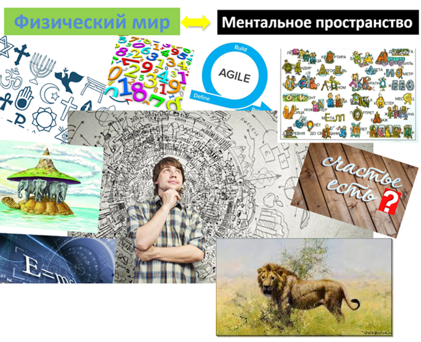

# Физический мир и ментальное пространство

Для того, чтобы разобраться в изучаемых в этом разделе понятиях, начнем с разделения понятий и слов, которые обозначают физический мир и ментальное пространство.

Постоянный прогресс в количестве взаимодействующих людей и в скорости адаптации человека к новым условиям стал возможен за счет того, что люди научились общаться с помощью знаков, слов, рисунков и т.п. Они придумали буквы, алфавит, числа и многое другое, чтобы описывать физический мир.

Есть слово «лев» или «lion» (по-английски), а есть живое существо, которое бегает по африканским прериям. Живое существо – представитель физического мира, а слова «лев» и «lion» – описания этого существа. Все описания происходят из ментального пространства. Я – человек, а мое описание – это имя, рост и т. д. Моя фотография – тоже относится к описанию.

Получается, что человек придумал ещё один «мир» — мир описаний или ментальное пространство. И он необходим человеку, чтобы менять физический мир, делать его лучше^[Деятель делает мир лучше за счет создания успешных систем.]. Поэтому системный деятель в любом проекте использует важный мыслительный прием – задает себе вопрос: «Что меняется в физическом мире в результате моей деятельности?» Если действие, проект или деятельность не приводят на каком-то шаге к изменению физического мира, то такую активность нет смысла делать^[Изменением мира могут считаться впечатления, которые вы получили в результате реализации проекта развлечений.]. Ресурсы будут потрачены, но мир от этого не станет лучше^[Условно, можно проводить большую бумажную работу, которая никому не нужна. Или копать яму, а потом её закапывать.].

Человек придумал также теории, которыми описывает или моделирует реальность (создаёт описания)^[И, конечно, с помощью которых создает системы. Но здесь мы хотим поговорить именно об описаниях.]. Картины или модели мира^[Обратите внимание, что слово «модель» в приводимом контексте больше адресует к содержанию, хотя это слово может означать какой-то конкретный объект. Например, вот я собрал модель самолета.] — это описания части физического мира, которые можно получить с помощью определенных теорий (когда-то открыли возможность делать фотографии). При этом не существует единого описания всего физического мира. Например, географическая карта – это модель или описание отдельной территории, а не всей Вселенной. При этом мы понимаем, что территория существует в реальном, физическом мире. И у этой территории может быть множество разных описаний (экономический или политический аспект, природные ископаемые и т. п.)^[Как вы уже догадываетесь, каждое описание отвечает на какой-то предмет интереса к территории.].

Описания реального мира можно разделить на две категории: научные и ненаучные. Научные – это теории, дисциплины, трансдисциплины. А ненаучные – истории, легенды, суеверия, мифы. Отличия между ними в том, что теории дают объяснение какой-то части действительности, которое выдерживает проверку научным методом. И это не будет зависеть от проверяющего. Более того, теорию можно записать одинаковыми знаками в виде формул или понятий, и она передаёт одинаковый содержательный смысл на разных языках. В свою очередь, ненаучные теории не имеют такой формальной строгости, хотя тоже описывают физический мир. Но мы будем далее говорить только о научных картинах мира.

