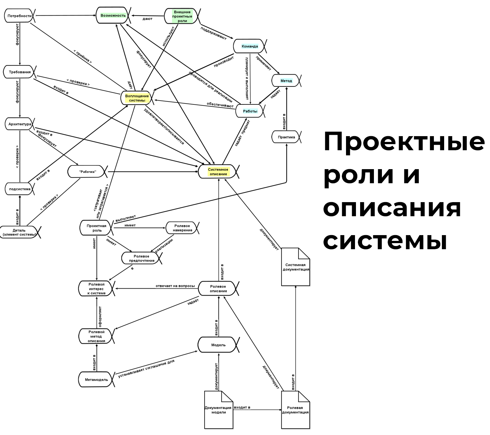

# Описания системы и системный язык

На схеме из учебника «Системное мышление» показана бо́льшая часть понятий системного мышления, которые мы уже обсудили. Беглость системного мышления, которая позволит применять его к рабочим проектам, означает, что вы можете легко видеть связи этих понятий между собой. На этой схеме – 7 основных понятий (альф^[Стандарт OMG Essence (http://www.omg.org/spec/Essence/) предлагает для контроля за изменением состояния проекта особый вид функциональных объектов — альфу (ALPHA или Abstract-Level Progress Health Attribute). Альфа — это объект внимания, функциональный/ролевой характер которого отвечает области интересов «как проект работает» (не целевая система, а проект, то есть системы создания). Если мы хотим связно мыслить о том, как работает проект, как целевая система создаётся и затем развивается создателями в ходе их работы, нам нужно удерживать внимание в проекте не на любых произвольных объектах, а на альфах.]) выделены цветом, остальные понятия и подальфы не выделены, однако, видно, что все понятия связаны друг с другом. И большинство связей упираются в воплощение системы. Это и есть наша успешная система, ради которой мы изучаем системное мышление со всеми этими системными понятиями.

Вам может показаться, что такой подход во многом излишен. Но представьте аналогию и составьте бытовую понятийную сетку, в основе которой будет автомобиль. У взрослых есть беглость мышления в отношении понятия «автомобиль» не в плане системного подхода, а просто как о предметной области. Вы, вероятно, быстро найдете такие понятия как топливо, движение, погода, пассажир, окружающая среда, роскошь, зимняя резина и многие другие, которые помогают объяснить деятельность, связанную с автомобилем.

Вы спокойно нарисуете схему, в которой все эти понятия будут связаны между собой^[Топливо заливается в бензобак автомобиля. В этом простом предложении я описал физический мир. Для этого я использовал понятия «топливо» и «бензобак», а также связал их другим понятием-действием «заливается». Дело в том, что вы с этими понятиями хорошо знакомы, и ваш мозг легко их связывает, а также быстро моделирует физический мир. Если вдруг топливо начнет течь мимо бензобака, вы предпримете определенные действия. И эти действия тоже можно будет описать определенной моделью.]. Для жителя 17 века многие термины, касающиеся автомобиля, будут абсолютно не понятными. Но вы спокойно оперируете этими понятиями, потому что живете среди них. Точно также рекомендуется «сжиться» с понятиями системного мышления, чтобы создавать успешные системы в личной жизни и в рабочих проектах. Беглое оперирование системными понятиями означает, что вы быстро находите их в своем проекте, например, целевую систему или метод описания для предмета интереса «цена» или «безопасность»^[Точно так же в бытовой жизни вы бегло оперируете понятием «мама» и «папа», и когда, например, вы приходите в гости к своему другу, то быстро разбираетесь кто есть кто.].

Использование системных понятий необходимо для того, чтобы составлять (моделировать) системные описания, которые требуются для создания успешных систем. При этом необходимо делать описания по всем областям интересов надсистемы, целевой системы и создателя.

В этом разделе мы обратим внимание на следующее:

* как описывать любые системы посредством системного языка, в том числе ролевые описания, модели, метод описания и т.п.;
* узнаем о четырех главных описаниях системы как прозрачного ящика, которые отвечают на предметы интересов внутреннего устройства любой системы;
* какая бывает документация для областей интересов трех видов систем.

