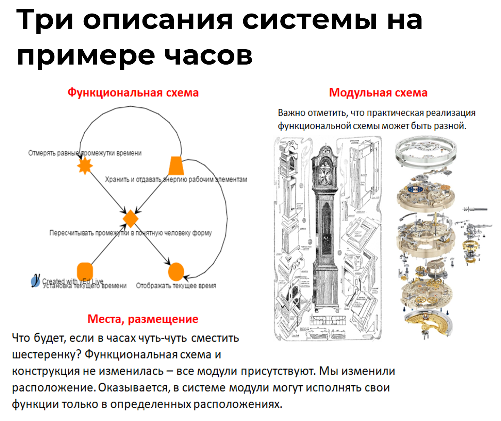

# Примеры описаний системы как прозрачного ящика

Рассмотрим три описания на примере часов^[Картинка сделана А.Турхановым.].

Функциональное описание – это описание подсистем как ролевых или функциональных объектов. Функциональное описание показывает, «как система работает внутри». Вот, например, на функциональной схеме показано, как работают часы. Обратите внимание, на этой схеме нет модулей, поскольку здесь нам важны функциональные части часов. Эти части показывают нам своё функциональное или ролевое поведение.

Конструктивные или физические модули – это объекты, которые собираются в систему часы. Модульное описание или модульное разбиение на части показывает, из чего собрана система. Как видите, на модульной схеме указано множество конструктивных частей системы. На ней не ясен принцип работы часов, но хорошо видно, как собрать часы из шестерёнок, пружинок, стрелок и других модулей.

Третье описание – это описание мест в пространстве, где размещаются части системы. То есть нам важно знать, где во Вселенной находятся части системы. Это пространственное разбиение. Если не знать точного размещения модулей, то система не заработает.

Системные уровни определяются по функциональному разбиению —главному в системном мышлении! Поэтому функциональное разбиение часто называют системным. А что насчет остальных? Это обычные разбиения. И, конечно, не стоит забывать, что есть модульное и пространственное разбиения.

Как вы можете видеть, все системы на каждом системном уровне взаимодействуют между собой как функциональные объекты. Это взаимодействие описывается функциональной схемой. На этом же системном уровне можно выделить конкретные физические объекты, которые выполняют данные функции (или играют роль функциональных объектов). Эти физические объекты расположены где-то в пространстве. Если мы перейдем на другой системный уровень, то там все будет точно так же.

Например, мы можем выделить функциональные, физические объекты и места их размещения на уровне подсистем мотора. Потом можем выделить функциональные, физические объекты и места их размещения на уровне всего автомобиля. И здесь мы уже не будем рассматривать структуру мотора, он будет частью системы автомобиль. Причем на систему-мотор можно посмотреть с функциональной точки зрения – этот функциональный объект должен выдавать крутящий момент^[Обычно функциональный объект системы-мотор в культуре называется двигатель. Это роль, функция которой двигать. Двигатели внутреннего сгорания двигают посредством крутящего момента, который передается шасси.]. Также на систему-мотор можно посмотреть, как на физический объект – это будет бензиновый двигатель БД-1324. Мы можем подняться ещё на один уровень выше, и там будут уже другие функциональные, физические объекты и места их размещения.

Следующий пример связан с системой человека-деятеля, который может создавать успешные системы в разнообразных проектах. У деятеля есть функциональное поведение – жизненное мастерство. Жизненное мастерство состоит из следующих функциональных частей:

* мыслительного мастерства или интеллекта;
* прикладного мастерства.

Еще один пример касается функциональных частей системы автомобиль. Это будут шасси, кузов, двигатель. Тут, в свою очередь, тоже можно сделать дальнейшее системное разбиение, и посмотреть устройство шасси. И, соответственно, выделить следующий системный уровень.

