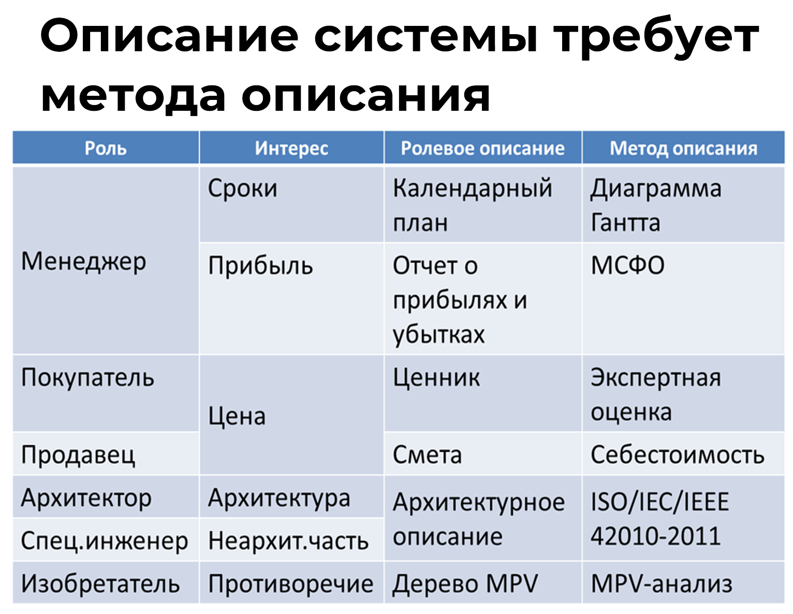

Вы уже знаете, что системное описание состоит из ролевых описаний, а те, в свою очередь, состоят из моделей. Для того, чтобы составить ролевое описание необходим метод описания (практика). Метод описания представляется как теория, которая объясняет, как создавать описания системы и необходимые инструменты, чтобы получить рабочий продукт (документация). В теории задаются метамодели, которые заполняют данными и они, соответственно, становятся моделями. Модели могут быть на разных носителях, например, на бумаге или в компьютере. И тогда мы говорим о документации.

Проще всего считать, что метод описания с содержательной точки зрения — это набор условных обозначений для многослойных карт-моделей, которые описывают территорию. Территория – это система, карта – это документация с описанием системы, но есть метод составления карты^[Например, фотограмметрический метод для создания топографических карт.], в котором присутствуют метамодели, понятия, принципы и т.п. А вот теория составления данного описания, наряду с технологией создания карты является методом описания.

Универсальность подхода верхнеуровневого моделирования означает, что описание делается в ответ на определенный предмет интереса (или предпочтения) к конкретной системе, и для этого роль (роли) использует определенный метод описания, с помощью которого получается документация, адресованная другой роли. Например, топологическая карта создается в ответ на интерес «рельеф» системы «территория» (какой-то местности). Карта создается топографами и используется геодезистами, геологами или географами, а может и проектировщиками, которые создают проект дома.

Метод описания позволяет создавать описания любых систем. Конечно, в первую очередь, необходимо обращать внимание на целевую систему, но в проектной деятельности или на предприятии вам встречается множество документов, в которых описываются самые разнообразные системы (надсистемы, подсистемы, системы создания и т.п.).

В вышеприведенной таблице вы видите связь понятий роль, интерес, ролевое описание и метод описания. Обратите внимание, что вы часто могли видеть подобные ролевые описания в виде документов. Многие из вас владеют различными методами описаний, посредством которых вы создаёте определенные документы. Обязательно опишите свои роли, методы описания и рабочие продукты в соответствующем упражнении на моделировании из курса.

Интерес у разных ролей может быть один, а ролевые описания разные. У одной роли может быть несколько интересов. При этом можно создать одно описание, которое отвечает на несколько предметов интересов.

Необходимо правильно выбирать методы описания. Например, для налогового, финансового и управленческого описания нужны разные методы. Для налогового – налоговый и бухгалтерский учет, для финансового описания – МСФО (международные стандарты финансовой отчётности) или US GAAP, а для финансового-управленческого описания есть методы управленческого учета. Заметьте, что все три описания (методы и рабочие продукты) созданы для трех разных ролей – для налоговика, акционера и менеджера.

Вы уже хорошо понимаете, что нельзя делать качественные ролевые описания, если ролевой метод описания и соответствующая документация не рассматриваются в явном виде. То есть нельзя их делать неосознанно. Осознанность в применении метода описания повышает вероятность того, что вы вовремя заметите необходимость освоения нового метода.

