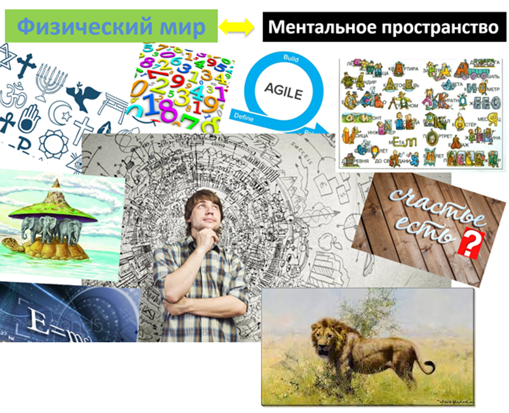

To understand the concepts studied in this section, let's start with separating **concepts** and **words** that denote the physical world and mental space.

The constant progress in the number of interacting people and the speed of human adaptation to new conditions has become possible because people learned to communicate using signs, words, drawings, etc. They invented letters, the alphabet, numbers, and much more to describe the physical world.

There is the word "лев" or "lion" (in English), and there is the living creature that runs across the African plains. The living creature is a representative of the physical world, while the words "лев" and "lion" are descriptions of this creature. All descriptions originate from mental space. I am a person, and my description is my name, height, etc. My photograph also pertains to the description.

It turns out that humans invented another "world" — **the world of descriptions** **or** **mental space**. It is necessary for humans to change the physical world, to make it better^[An actor makes the world better by creating successful systems.]. Therefore, a systems actor in any project uses an important mental trick — asks themselves: "What changes in the physical world as a result of my activity?" If an action, project, or activity doesn't lead at some step to changing the physical world, then such activity is pointless^[Changes to the world can include the impressions you gain from implementing an entertainment project.]. Resources will be spent, but the world won't become better for it^[For instance, one could do a lot of paperwork that's unnecessary. Or dig a hole just to fill it back up.].

**Humans also invented** **theories that describe or model reality** (create descriptions)^[And, of course, with which they create systems. But here, we want to talk specifically about descriptions.]. Pictures or models of the world^[Note that the word "model" in the given context refers more to the content, although the word can mean a specific object. For example, I assembled a model of an airplane.] — are descriptions of part of the physical world, which can be obtained through specific theories (once the possibility of taking photographs was discovered). At the same time, there is no single description of the entire physical world. For instance, a geographical map is a model or description of a specific territory, not the entire universe. We understand that the territory exists in the real, physical world. And this territory can have many different descriptions (economic or political aspect, natural resources, etc.)^[As you might guess, each description answers some subject of interest regarding the territory.].

Descriptions of the real world can be divided into two categories: **scientific and non-scientific**. Scientific descriptions include theories, disciplines, transdisciplines. Non-scientific ones are stories, legends, superstitions, myths. The difference is that theories provide an explanation of some part of reality that withstands testing by the scientific method. This will not depend on the verifier. Furthermore, a theory can be recorded using the same symbols in the form of formulas or concepts and it conveys the same substantive meaning in different languages. In turn, non-scientific theories do not have such formal rigor, although they also describe the physical world. But we will further discuss only scientific pictures of the world.