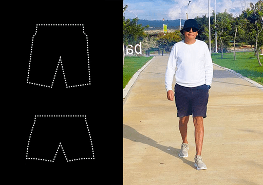

I'm getting ready for another trip. I decided to travel light, so I'm taking a small carry-on suitcase. There's no room for extra items, so I need to take only the most important things. During the process of selecting items, a methodological example emerged: how to explain several concepts of systems thinking.

**What should you consider?** We will talk about different types of objects --- functional and physical.

An item or thing can be viewed from a functional perspective, where its function is important to us. Alternatively, we may need to look at its physical characteristics, requiring us to see it in reality.

On the trip, I'll need shorts and swim trunks. Usually, we are not aware of the types of objects we are dealing with. But even if we don't distinguish between the notions of a "functional object" and a "physical object," it doesn't prevent us from making the right decision in this everyday example. However, when creating complex systems, the separation of these two concepts will be extremely useful. This is the essence of systems thinking.

**Let's start packing.** "Shorts" and "swim trunks" at the packing stage are functional objects, not specific physical ones. Shorts and swim trunks have different functions, and this is the most important thing to understand during the design process.

Now I am planning the trip and necessary systems that will be used. Therefore, I think of systems as functional objects: what I will need (functional objects) to be provided with all the essentials and to perform different roles.

When I model the future, I first think of functional objects.

**Set constraints.** Next, due to the size of the suitcase, I decide that I can take only one specific physical item (physical object) that will serve as shorts or swim trunks depending on the situation.

Not every item can fit both roles simultaneously (role is synonymous with functional object). But, fortunately, I found such an item: it's long, blue swim trunks-shorts from Boss. They will perform the functions of shorts or swim trunks. These are what I'm taking on the trip. Now, in different situations, I will use a specific physical object --- long swim trunks-shorts.

**Understand how concepts are structured.** The items and things that surround us are designated by the words that are commonly used to name them in society. In culture, it is often customary to name items according to their main functional use.

We can say that items called "shorts" and "swim trunks" inherited their names from the functions of the corresponding functional objects. For example, shorts evolved from cut-down trousers, and an airplane is an object whose main function is to fly independently.

**Practice systems thinking.** A good skill for a systems thinker is to distinguish the context in which words like "shorts" and "swim trunks" are used. In each statement, you can track whether it refers to functional objects or specific physical instances (objects, things).

For example, here are two statements: "I think I will need shorts on the trip" and "I will take these blue shorts with me". In both sentences, the same word "shorts" is used, but in the first sentence, it is a functional example, while in the second, it is physical.

Such a skill, among many other skills of systems thinking, will be especially useful when dealing with systems in your work projects.