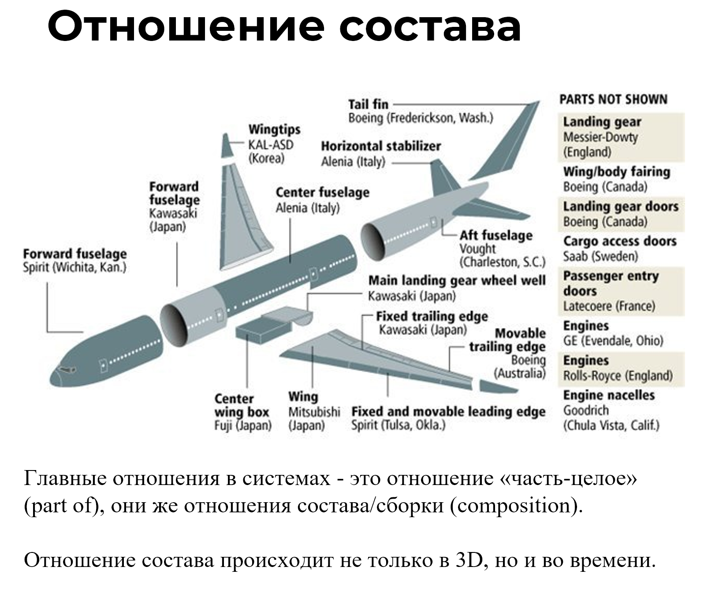

When we talk about embodiment, it is necessary to keep in mind the main relationships in systems, which are called **the "part-whole" relationship, also known as composition or assembly relationships.**

Engineers often refer to this as the breakdown of a system. The main thing in systems is **system breakdowns**. The levels of this breakdown are **system levels**. A system actor is well-equipped with a cognitive technique through which they can break down any subject area into system levels according to different contexts (subjects of interest).

**Breakdowns are made by a person's attention in a role** or by a team; nothing is actually broken down in the physical world! If we use our attention to break down an elephant into a trunk, ears, legs, tail, etc., it does not mean we have physically separated these parts from the body. For some reason^[For certain purposes, for example, to consume the elephant in parts.] we singled out these parts in the elephant with our attention! Moreover, we identified the entire elephant as a part of the physical world with our attention! After all, we specifically needed the elephant. We can continue by identifying a group of elephants, and then the savannah, where other animals reside besides elephants. In this way, we identified several system levels with our attention.

The main approach in breakdowns is **from part to whole** **or from whole to part** **concerning the 4D dimension.** In 3D it is more or less clear: the wing and fuselage are parts of an airplane, the fuel pump is part of the engine, which in turn is part of the airplane. If we accept that all systems exist not just in physical space but in space-time, then the entire conversation about different states of the system or its different roles becomes a conversation about parts in time. For example, an egg is simply part of a butterfly in time—as long as the butterfly is in the "egg" stage, no other "butterfly," which occupies the egg's place in the physical world, exists.

Thus, states of the system or its roles can be treated as separate objects, and they can receive **separate names**. A butterfly in the "egg" stage is called "an egg." Pyotr Sidorovich, while sick, is called "the patient." And "the patient" is simply a role or state of Pyotr Sidorovich.

**Breaking down a system into parts, especially when it involves time, is a complex skill**. It needs to be trained. One must start with understanding the composition relation. Unfortunately, intuition often fails here. Systems thinking is counterintuitive, so sometimes the help of a teacher is required. Furthermore, it is important to practice solving educational tasks. We will identify system levels while studying section 5, and in this section, try to identify a subsystem, sub-subsystem, and supersystem within the system.