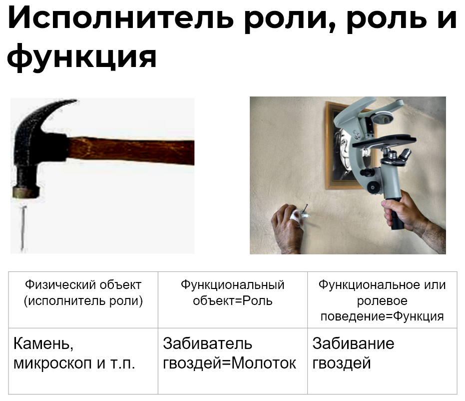

In the previous section, we briefly discussed the difference between **physical object, functional object, and functional (or role) behavior**. For example, a physical object is a microscope^[Although, when we say "microscope", we initially mean the role "microscope". But we also use this term for the physical item commonly known as a microscope. Only from the discussion context can this difference be understood. It's great if you grasped this duality, as with the hammer. A Systems person understands this distinction well. It's better to start with a stone.] or a stone. These objects can play different roles and perform various functions assigned to them. The functional object or role in our example is the "nail driver". In culture, it's customary to call this role a "hammer". The function or functional or role behavior is driving nails.

As mentioned earlier, each role has culturally conditioned^[Or defined by cultural norms and rules, i.e., accepted in culture, in norms of behavior, usage, etc.] behavior and a corresponding name established in culture. Everyone understands what the role of "hammer" and its behavior of nail driving are. The physical item that can become a hammer^[That is, play the role of a hammer. Note that the logic is the same if we talked about Ivan Ivanovich or Marfa Petrovna playing the role of a manager.] can be different.

This way of thinking, when things are named by their primary function^[Or by their role behavior.], significantly saves the brain's computational power. That is, **first we consider** **actions (behavior** **and other** **activity), and then find the physical** **objects that can perform these actions**. Cultural conditioning allows for quicker agreements^[Though not all established names for items support this principle. Sometimes, ancient names have obscure origins and often refer to not the role/function but the form or something else. As a matter of good practice, in team system development, the system's name should seek the role — an indication of the function or actions of this role.]: there's no need to every time call a functional object "person who drives a car". Instead, we designate this role quickly and concisely — driver^[Similarly, it was previously proposed not to call the functional object "nail driver" but to transition to using the role name "hammer".].

Here's a brief summary from the textbook "Systems Thinking":

"Systems are primarily considered as functional (role) objects at the moment they perform their function, meaning they are ready and working. At this moment, they benefit those who need this function. For example, an airplane as a system is primarily a role or functional object that flies itself while carrying passengers and cargo by air. The most common purpose or function of an airplane is to fly itself, which is reflected in the system name airplane.

The primary purpose of a pump is to pump. That's why this product has been named so culturally. Manufacturers want to please customers, so they name their products so that the customer quickly understands the benefit. Customers consciously (or intuitively) understand the desired function and start familiarizing themselves with manufacturers' products from their functional names^[Products can also have other names, for example, names. Airplanes often have the names of great people.]. Nonetheless, a system named by the manufacturer "Pump NV-23"^[Here we speak about the physical object - "Pump NV-23", which can perform the function — pumping and play the role — pump.] can perform a different function for the customer. For instance, to pressurize antifreeze. In this case, the customer's demand for a function has changed, and they need a functional object — antifreeze pressurizer. Will "Pump NV-23" suit the role of "antifreeze pressurizer"? Possibly, it will.

Thus, a pump can be named "antifreeze pressurizer in the second cooling circuit" if its role assignment is to pressurize antifreeze in the second circuit. The factory will sell the physical object "Pump NV-23"^[This product was intended for the role of a pump, i.e., to perform the function — pumping.], and the buyer will use it for a different role (pressurizer). This happens frequently. Without usage context, it's "just a pump", i.e., a constructive object, and it lacks an environment. In the role-playing context — it's a role object, "antifreeze pressurizer in the second cooling circuit". Outside the context of engineering capabilities, Masha is simply Masha, she can be many things. Just like a microscope: it can show small objects, crack nuts, drive nails, or be used as a paperweight. Masha can do many things too. But at the moment of performing the engineer role, the role behavior, Masha will be called "engineer". And that's normal."

Therefore, **it's important to name systems by their primary purpose**^[Keep in mind that in established item names this rule may not be followed, but in your projects, you will save much time by adhering to it. You will reach agreements faster and understand customer requests and your product more clearly. Read more about system naming in section 5 of the online course "Systems Thinking".]**, that is, by the roles assigned to them**. These roles define the function. However, sometimes the function is clear, but naming the role immediately can be difficult^[It quickly becomes clear that the function "nail driving" is needed, accordingly the role is a nail driver. But naming the role "hammer" requires an activity perspective. A hammer is more or less understood by everyone, but try naming the project roles at an aircraft factory or subsystems of an airplane.]. To easily find the role name requires a good activity perspective.

When we name the system "microscope", we primarily mean it allows "looking at small objects" at the moment when it is fully assembled and working. If we thought we would use this object to hammer something, we would say this physical object "Microscope MP-2" would play the role of "hammer" and perform the function of hammering or pounding.

And if someone declares a person to be a system, usually little can be instantly said about their function in the environment. A person is a multifunctional object, capable of performing many actions, and a person can be viewed as a biological body (this is how, for instance, medicine sees it). We mentioned in the previous section that a person can play various roles. Therefore, the role behavior or functions of people will always need to be dealt with separately and specifically. But **thinking** **about** **people in the role and about microscope-in-the-role is arranged the same**!^[Systems thinking starts with viewing systems as role (functional) objects that behave somehow in their environment. That is, we first consider the function being performed or required, the played role or designation. Only then do we deal with the construction or physical object that will play the identified role.]

If it's difficult for you to understand all these concepts, and you don't see the importance of such separation for project activities, it means you have gaps in ontological knowledge. To master systems thinking, it's necessary to have a **type machine**^[Recall, it's such an ability to track the types of applied concepts and not to confuse, for example, the role and the performer, system and process, function and design, etc.]. If you have difficulties with this, we recommend taking the course "Rational Work".