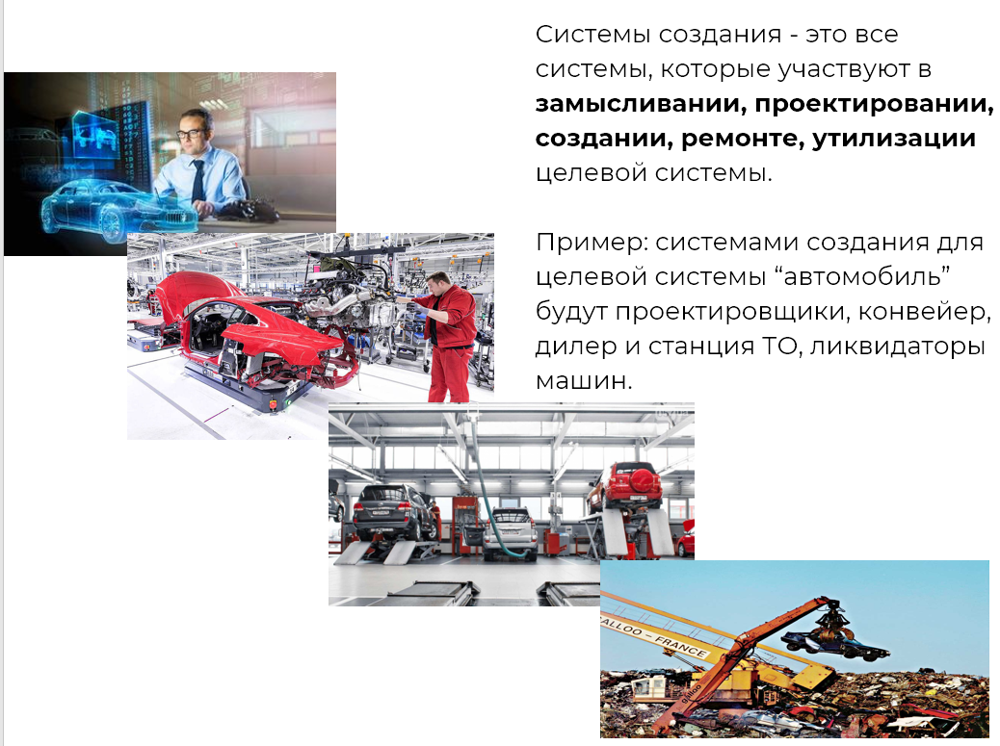

Any activity becomes much more productive if you understand its purpose. From a systems perspective, it can be said that **the goal of any activity is to create the system of interest.** Accordingly, creating systems will be involved in the activities to realize this system of interest in the physical world. Usually, this creative activity is called a project, process, program, etc. We must not confuse the types "project" and "enterprise" (or "extended enterprise"), as the former is an activity, and the latter is a system.

For example, the goal of the activity of creating systems will be the system of interest—a Mercedes E-Class car. Factory activity is the process involving specific creating systems, such as those that perform assembly.

**Creating systems are defined as** **those** **systems that support all stages of the system's development from its conception to disposal.** In our example with the system of interest "car," factory activity involves designers, component suppliers, and assembly lines. However, creating systems also include service stations and car dismantlers, which are not necessarily part of the automotive concern. Very rarely do all creating systems belong to a single enterprise, which is why we speak of an **extended enterprise**.

An important note about creating systems is that one should not call an activity a system of interest. Firstly, an activity is not a system (neither a system of interest, creator, nor any other). Secondly, when you see an activity, it is most likely the activity of some creating systems that create a certain system (either system of interest or ours). It is better to first understand the purpose of this activity. Most likely, it is aimed at creating a system. That is the one that will probably be the system of interest, and what you are engaged in—such as factory activity—will merely be the activity of some creating systems.

It is also not recommended to call a factory a system of interest. The system of interest is likely to be the factory's products. Therefore, it is always necessary to find out what the factory produces. An iron factory and an automotive factory are completely different enterprises. The system of interest determines what creating systems must be like. Therefore, you first need to understand what the enterprise produces, which will help to better understand how it should be structured. Thus, the design of the plant depends on the factory's products, which will be the system of interest.

Then you can move to another project where the creating system becomes "our system." It often happens that in project activities you think about the system of interest "car," but at the same time you also need to build a factory (hire and organize people) that will produce this car. In such cases, it is essential to manage your attention by separating these two considerations.