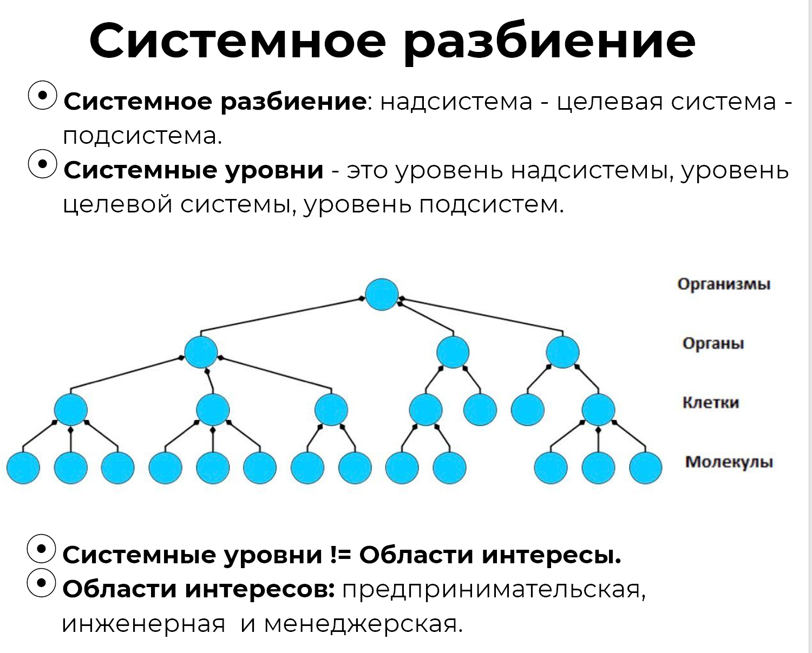

We have dealt with areas of interest, and now let's talk about system partitioning and system levels. **Do not confuse the concepts** of **“areas of interest”** (systems and roles) **and** **“system levels”.**

As you already know, systems can be viewed from different perspectives:

- when the system is a whole for some parts within it, meaning the whole system consists of subsystems;
- when the system is a part of some supersystem, meaning the system itself is a subsystem.

Each subsystem is also a whole for its sub-subsystems, and each supersystem is a part for a super-supersystem. Thus, one can speak of system partitioning into parts from top to bottom or bottom to top. If we do not plan to further divide a system into parts, it is called an **“element of the system”**, emphasizing that somewhere there is a whole system for which this subsystem is an element.

The levels in system partitioning are called **system levels**. They are highlighted through the part-whole relationship. With its help, we logically define these levels in the physical world. Of course, there are no special boundaries-levels in the physical world; the systems thinker defines them with their attention.

The classical system partitioning into levels came from biology. The image shows that cells consist of molecules, but at the same time, cells themselves are part of organs. Organs consist of cells, but organs are parts of organisms. And so on. A person in the specific role of a biologist decided to divide the world into parts in this way and found corresponding names for these parts and levels^[Similarly, you will have to
find the names of parts and system levels in your work projects.].

The image shows system levels — the level of organisms, organs, cells, and the molecular system level. But the biosphere system level is not shown, as it is above the level of organisms. Also, there is no atomic system level, as it is below the level of molecules. This does not mean they do not exist, we simply did not indicate them on this scheme.

**System levels in your activities are also defined based on necessity**. Generally, a limited number of system levels are used in project activities, and you are unlikely to consider more than 3-5 levels in your work. However, you cannot disregard them entirely since interaction between levels (inconsistencies) always occurs.

At the same time, it is important to pay attention to other systems located at the same system level. Attention should be sufficient to track systems in the environment and the physicality of part-whole relationships several system levels down and up. You cannot work without concentrated attention, unconsciously drifting into mental space, or confusing what is part and what is whole — this is dangerous for the project.

Having fixed the system level, we can then discuss areas of interest. For example, in section 4, we identified areas of interest for the system level “car,” and then we can discuss the areas of interest of the supersystem (car+driver) and creator. Similarly, areas of interest can be identified for the system level “engine” or “piston.” Different teams work at different system levels and with different areas of interest. And when we need to build a 3x3 Table for a specific system, for example, a car, we need to understand that the table for the car is different from the table for the engine and piston, and we need three different tables.

At the same time, note that **system levels and areas of interest** do not completely overlap^[If you experience any misunderstanding here, please consult
the instructor. Without understanding this distinction, further study
of the textbook will be impossible.]. These are different concepts applied to
the chosen system. And in relation to this system of interest, areas of interest and system levels are identified. For example, if we take the system “car,” the area of interest of the supersystem will be associated with “car+driver”^[Or “car,” if we create
a 3x3 Table for the “engine” system or with the “engine,” if we create
a 3x3 Table for the piston.]. And the area of interest of the system of interest
will be related to the “car”^[Or respectively to the
“engine,” or the “piston.”]. However, the area of interest of the creator will not be included in the system levels “supersystem — system of interest — subsystem.”