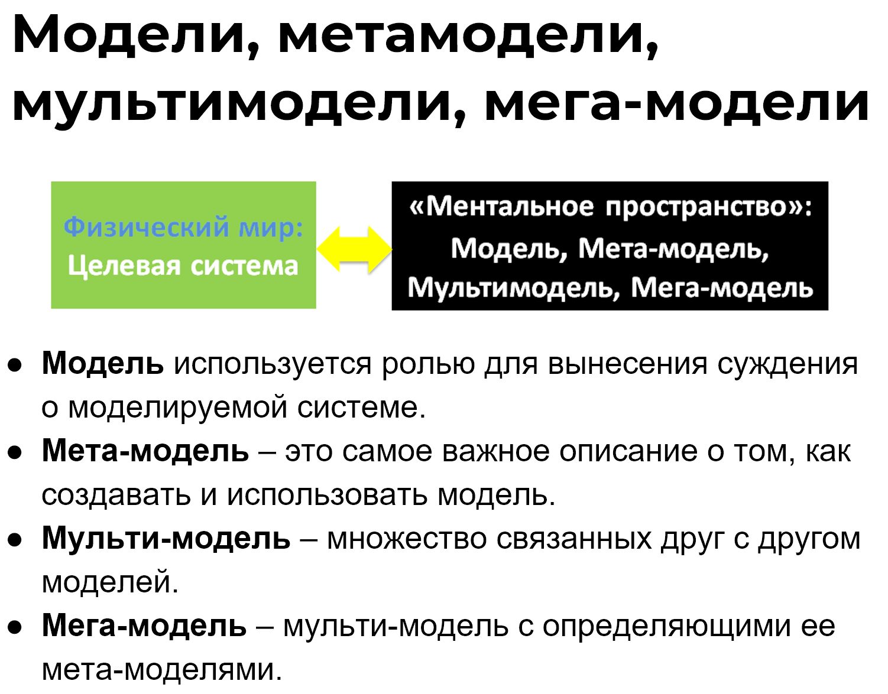

You already know that the result of modeling is **models,** which can exist on different physical media. A model helps to make a judgment about the object being modeled. The object being modeled is the system of interest, as well as other kinds of systems. Models exist for the supersystem, creating systems, systems in the environment, or subsystems.

Let's emphasize once more that models are created using a specific description method. It indicates what is most important in the object being modeled and what needs to be considered in the models. This "most important" for a specific model is called a **meta-model**.

For example, there is a system — the city of Moscow. And there is a map of the city. The map is a model of Moscow. And the legend of the map is the **meta-model**. The map contains an insignificant portion of information about the city, but it is the most important information that someone decided to reflect. One map might show city districts, another — roads and industrial enterprises, and another — water protection zones, etc.

The legend of each such map indicates what is important in the territories and what should be depicted specifically in these models. You will see the road on the map, it's important, but its width, you won't, because it wasn't important for the composer of this particular map.

A set of connected models, made using different description methods, is usually called a **multi-model**. It's like a collection of many maps for the same territory: flora, fauna, population density, relief, road networks, etc.

In addition to the set of maps, we also need to have a set of legends for these maps. We will call a multi-model along with its defining meta-models a **mega-model**.

Read more about models, meta-models, multi-models, and mega-models in the textbook "Systems Thinking". It's useful for broadening one's horizons. And then it is necessary to apply these concepts in project activities.

Errors in the system model should ideally be identified (corrected) during the description and documentation of the system, that is, before its creation, not after, and certainly not during the system's operation. As the saying goes: describe seven times, create once!