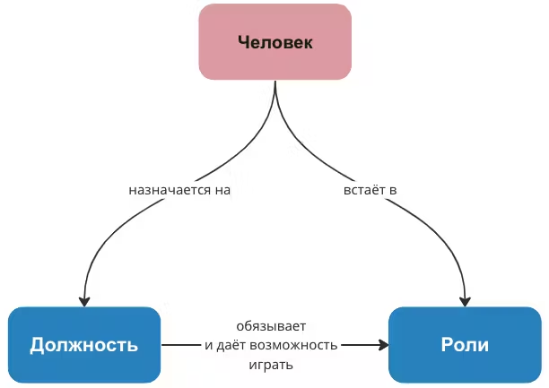

# Должность, успешная система и интеллект

Наряду с понятием роль используются такие понятия как должность, звание и квалификация. Они помогают лучшим образом описывать человеческую деятельность.

**Квалификация и звание -- это характеристики исполнителя роли.** Квалификация показывает степень мастерства человека в исполнении какой-то роли. Данную оценку даёт какая-то организация, сообщество или государство. Звание присваивается компетентными органами и отражает положение человека в определенной иерархии, установленной этими органами. Например, в науке, в армии, в компьютерных играх и т.п. В МИМ тоже есть своя квалификация[^144] и 8 квалификационных уровней.

**Должность** **определяет возможность и обязанность играть определенные роли, а также задаёт полномочия по распоряжению ресурсами** (деньги, время исполнителей). Например, в должностных инструкциях записаны обязанности, которые можно понять как обязательства играть одни роли и возможность играть другие. Также в кадровых и должностных документах определяется, какими финансовыми, материальными и людскими ресурсами может распоряжаться человек на определенной должности. На должность человека назначают, и он подписывает соответствующие документы насчёт своих прав и обязанностей. Например, назначают на должность руководителя предприятия.

Обыватель будет говорить, что после назначения на должность человек обязан соблюдать должностные инструкции, а с точки зрения системного мышления можно говорить, что **на должности человек имеет возможность и обязанность играть соответствующие роли и распоряжаться определенными ресурсами**.

**Руководитель предприятия -- это должность**, которая обязывает человека, как минимум, играть роли менеджера и лидера. Он отвечает за ресурсы предприятия. И у него есть возможность сыграть любую роль на своём предприятии. А кто ему может запретить?[^145]

Приведем ещё одну схему, которую предлагается изучить самостоятельно. Читая учебник, попробуйте разобраться, почему важно получать фундаментальное образование или развивать интеллект (включая кругозор), а также, как с помощью системного мышления можно объяснить профессиональный и должностной рост.

Подробнее эту схему разбирают на тренировках с участием мастера.

Таким образом, на сотрудника предприятия можно посмотреть с нескольких точек зрения:

- функциональное рассмотрение -- роль, действия по роли, методы;

- организационное рассмотрение -- должность, подчинение и руководство, распоряжение ресурсами, организация и выполнение работ.

Человек-агент на должности[^146] с определенными ресурсами (финансовые, технологические и т. п.) -- это минимальное **оргзвено.** Оргзвеньями также являются подразделения: отделы, департаменты, предприятия холдинга.

Когда проектируют организации, в них выделяют **организационные места:** должности и позиции в штатном расписании (в органиграммах), вакансии и т.п. Таким образом можно увидеть структуру подчиненности одних организационных мест другим. Когда на организационное место становится человек-агент, то появляется оргзвено. **Организация** -- это организованная группа людей, которые понимают свои полномочия, подчиненность, роли, ответственность за ресурсы.

[^144]: https://system-school.ru/qualification

[^145]: Некоторые руководители пользуются такой возможностью, и замыкают решение всех вопросов на себе. Таким образом, они сами играют все роли, а сотрудники только готовят документы, но не принимают решений по своей профессиональной роли, не ставят «шкуру на кон». Представьте хирурга, который во время операции идёт к главврачу с просьбой утвердить место, где надо сделать надрез.

[^146]: И, соответственно, имеющий право и/или обязанность исполнять определенные роли.

