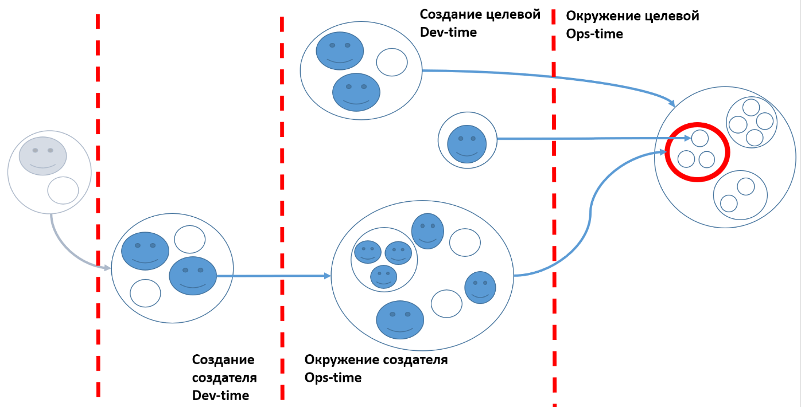

# Суть системного мышления

Зная все виды систем, вы сможете быстрее остальных разбираться в любой сложной деятельности. Вы сможете буквально разрезать мир на части своим вниманием, выделяя определенные системы. Мир сложный и все его элементы соединены между собой. Человеческому мозгу сложно ухватить все связи, поэтому **в системном мышлении задаются принципы того, как логически разделять мир на части.** С отдельными частями намного легче разобраться. При этом мы не теряем связь этой части со всем остальным.

Вот, например, слева на схеме из руководства «Системное мышление»[^170] вы можете видеть системные уровни по отношению к целевой системе, которая обозначена красным кружком. На верхнем уровне надсистема (большой круг, в котором красный кружочек), внутри которой целевая система (красный кружок) и на этом же системном уровне две системы в окружении. На системном уровне внутри целевой системы мы видим три подсистемы. Под эту схему хорошо подходит наш пример с автомобилем. Попробуйте сами сопоставить автомобиль с его подсистемами, водителем и пассажиром.

За пунктирной линией находятся многочисленные системы создания. Некоторые из них создают надсистему, другие являются системами создания целевой системы, а третьи участвуют в создании подсистем. По этой схеме можно обсуждать не только автомобиль, завод, но и систему, которая строит завод. Конечно, не всегда нужны такие сложные схемы, но важно понять, что системное мышление помогает рассматривать самые сложные системы и сложную деятельность. Попробуйте с помощью этой схемы рассмотреть деятельность вашего предприятия. Сразу скажу, что это будет довольно сложно. Более подробно кейсы студентов мы разбираем на тренировках с мастером.

