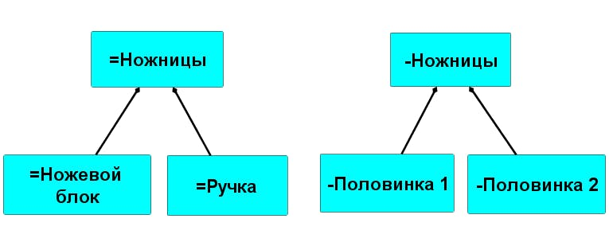

# Главные описания системы как «прозрачного ящика»

В системном моделировании мы всегда начинаем работу с **области интересов надсистемы**[^213] --- определяем внешние проектные роли, их потребности и предметы интересов. А уже потом переходим к устройству целевой системы, о которой поговорим в этом подразделе. И уже в следующем разделе 7 вы узнаете об особенностях моделирования систем создания.

Целевая система рассматривается как «черный ящик» и как «прозрачный ящик».

Система как черный ящик описывается через ролевое поведение и функцию, предметы интересов, возможности (потребности) и внешние проектные роли. **Система как «черный ящик»** описывается как будущая[^214] или уже как существующая[^215], но в обоих случаях нужно обращать внимание на следующие основные описания системы:

- как функционального/ролевого объекта и его поведение во взаимодействии с окружением в момент эксплуатации;

- как конструктивного объекта, который представлен в физическом мире и занимает место в пространстве в момент эксплуатации;

- как место, куда должна размещаться система;

- как полную стоимость владения системой.

Обратите внимание, что исходя из этих описаний системы как «черного ящика», вытекает описание системы как «прозрачного ящика». Внутреннее описание является неотъемлемым следствием внешнего. Например, в разделе 3 мы уже говорили о роли архитектора, который определяет конструктивное (модульное) устройство системы, исходя из архитектурных предметов интересов системы.

В этом подразделе **поговорим о том, как описывается внутреннее устройство системы («прозрачный ящик»)**. Условное «разбиение» системы на части может быть сделано разными способами[^216]. Вот четыре основных вида деления системы на части и соответствующие описания на примере системы «чайник»:

- кто-то интересуется функциями частей в ходе эксплуатации и скажет, что заварочный чайник состоит из ёмкости, литьевого носика, заливочного отверстия в ёмкости, ручки на ёмкости, крышки и ручки на крышке, а ещё паровыпускного отверстия в крышке, иначе при закрывании мокрой крышки из носика будет выплёскиваться вода. Это так называемое **функциональное описание** системы чайник, а описание подсистем как ролевых (функциональных) объектов называют **системным разбиением.**

- другой говорит про то, что заварочный чайник состоит всего из двух деталей в конструкции чайника, которые нужно изготовить, ибо его интересы лежат во времени изготовления чайника. Тут предмет интереса в конструкции, а именно в том, «что изготовить» или «как собрать». Это **модульное (продуктное) описание системы**.

- третий говорит, что крышка и чайник должны храниться рядом, и лучше бы крышка была прямо на чайнике. Это интерес в размещении, то есть «где во Вселенной находятся части чайника». Это **описание мест, размещений (пространственное описание)** частей системы внутри неё.

- четвертый говорит о стоимости частей чайника, то есть на что потребуется потратить деньги и иные ресурсы. Это **стоимостное описание**, которое входит в состав описания полного владения системой как «черным ящиком».

Системное мышление предусматривает множество описаний системы. Но выделяются четыре основных вида описания или точки зрения на деление системы на части[^217]. Основные решения по устройству системы называют **концепцией системы**. Обычно концепция системы составляется не единожды, она постепенно обрастает деталями, пока точность описания системы не оказывается достаточной для её изготовления на производственной платформе. То есть концепция системы «живая», она меняется в ходе развития, система постоянно модифицируется даже после начала её эксплуатации.

Чтобы составить каждое из этих описаний системы, необходимо знать определенную практику или **метод описания.** Посредством данного метода получается определенный рабочий продукт. Например, ранее приводили пример, что по методу описания управленческого учета можно получить финансовое описание системы предприятие, которое интересует менеджера.

Обратите внимание, что все эти описания не совпадают между собой. Особенно **сложно заметить несовпадение функционального и модульного описаний**. Обычно разработчики определяют основную функцию системы и рассматривают систему как функциональный объект, который состоит из функциональных подсистем. А уже архитектор определяет, какие конструктивные модули (исполнители) будут играть эти роли. При этом совпадение функциональных и модульных частей необязательно должно быть 1 к 1, и название этих частей может быть разным. Посмотрите на пример с ножницами, где функциональные части -- ножевой блок и ручка, а модульные части -- половинка 1 и половинка 2.

В системных проектах происходит функциональный анализ, то есть разделение на части (анализ -- это разделение), и модульный синтез, то есть сборка. Опасайтесь проекта, где непонятно кто принимает решения по синтезу. В таких проектах обычно работают аналитики, но они не меняют мир. Меняют мир синтез и решения по синтезу!

Таким образом, человек с системным подходом способен рассмотреть структуру любой системы как «прозрачного ящика», выделив как минимум четыре предмета интересов:

- функциональный=ролевой=аналитический[^218];

- модульный=конструктивный=синтетический;

- пространственный=места=размещения;

- стоимостной=экономический=ресурсный.

